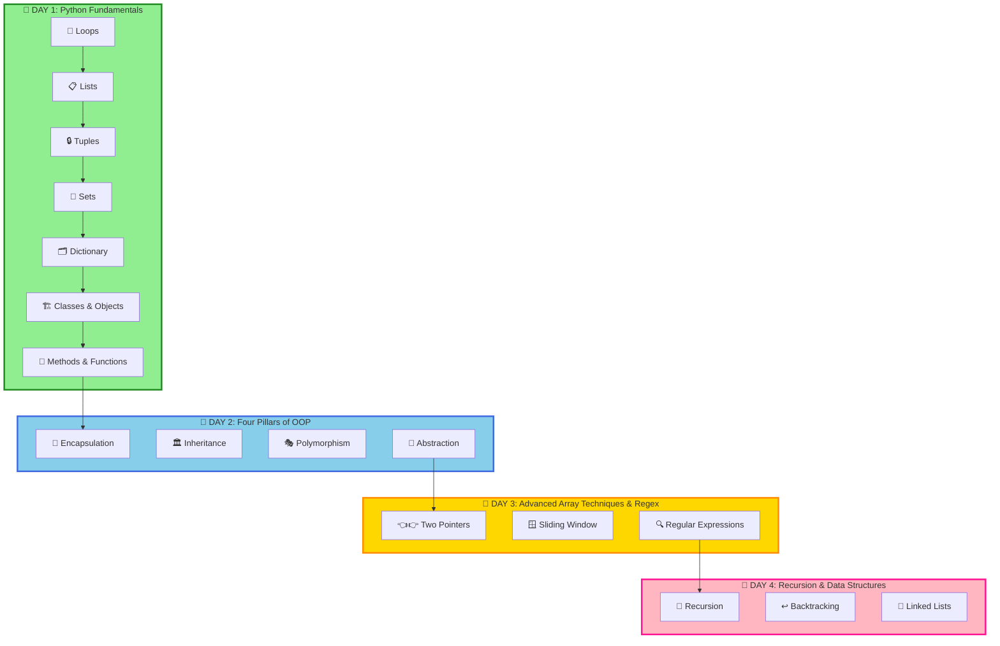

<div align="center">

# 🐍 Advance Python – NMIMS


### 🚀 *Crack DSA with Python – From Logic to Problem Solving!!!*

**Resource Link - <a href="https://canva.link/52roxdoar8i7rrl" target="_blank"  style="text-decoration: none">👋 Click Me</a>**

**Welcome to your comprehensive Python learning journey!**
Everything you need to become proficient in Python and master the core concepts of programming.

[📚 Topics Covered](#-day-1-topics) • [💻 Problems Solved](#-day-3---problems-covered) • [🎯 What's Next](#-day-4-recursion-backtracking--linked-lists)

---

</div>

## 📊 Learning Progress

```
Day 1 - Loops, Lists, Tuples, Sets, Dictionary & Class Objects:
████████████████████████████████ 100%

✅ Loops (for, while, nested loops, list comprehension)
✅ Lists - Creation, Append, Access & Methods
✅ Tuples - Immutable Sequences, Index, Count
✅ Sets - Unique Collections, Union, Intersection, Duplicates
✅ Dictionary - Key-Value Pairs, CRUD Operations
✅ Class & Objects - Constructors, Methods, Instances
✅ Static Methods & Instance Methods

Day 2 - Four Pillars of OOP:
████████████████████████████████ 100%

✅ Encapsulation - Data Hiding & Access Control
✅ Inheritance - Code Reusability & Type Hierarchy
✅ Polymorphism - Method Overriding & Same Interface
✅ Abstraction - Interface Definition & Implementation Hiding

Day 3 - Two Pointers, Sliding Window & Regular Expressions:
████████████████████████████████ 100%

✅ Two Pointers - Converging Pointers & Array Traversal
✅ Sliding Window - Dynamic Window & Optimal Subarray
✅ Regular Expressions - Pattern Matching & Text Processing

Day 4 - Recursion, Backtracking & Linked Lists:
████████████████████████████████ 100%

✅ Recursion - Function Calling Itself & Divide & Conquer
✅ Backtracking - Try & Revert Approach & Constraint Satisfaction
✅ Linked Lists - Node-based Data Structure & Pointer Manipulation

Day 5 - Linked List Variants & Stack Data Structure:
████████████████████████████████ 100%


✅ Singly Linked List - Single Direction Traversal & Operations
✅ Doubly Linked List - Bidirectional Traversal & Dual Pointers
✅ Circular Linked List - Cyclic Structure & Tail-to-Head Connection
✅ Stack - LIFO Principle & Push-Pop Operations

Day 6 - Stack Problems, Queues & Introduction to Trees:
░░░░░░░░░░░░░░░░░░░░░░░░░░░░░░░░ 0%

⏳ Valid Parentheses Problem - Stack Application
⏳ Queue Data Structure - FIFO Principle & Operations
⏳ Trees - Introduction to Tree Concepts & Terminology
```

---

## 🗺️ Learning Path



---

# 📅 DAY 1: Python Fundamentals

## 📚 DAY 1 - Topics

<details open>
<summary><h3>🔄 Loops & Iterations</h3></summary>

> **Loop:** A programming construct that repeats a block of code multiple times based on a condition.
> **Iteration:** The process of executing the same code multiple times for different values.

### 1️⃣ **For Loops**

#### Creating Lists with For Loops

```python
# Create a list of squares from 1 to 10
arr = []
for i in range(1, 11):
    arr.append(i * i)

print(f"Array = {arr}")
# Output: Array = [1, 4, 9, 16, 25, 36, 49, 64, 81, 100]
```

#### Iterating with For Loop

```python
# Traditional iteration
fruits = ["Apple", "Banana", "Mango", "Orange"]

for fruit in fruits:
    print(fruit)

# Iteration with index
for i in range(len(fruits)):
    print(f"{i}: {fruits[i]}")
```

</details>

---

<details open>
<summary><h3>📦 Lists - Dynamic Arrays</h3></summary>

> **List:** An ordered, mutable collection of elements that can contain items of different data types.

### 2️⃣ **List Declaration & Operations**

#### 📊 Creating Lists

```python
# Empty list
empty_list = []

# List with initial values
numbers = [1, 2, 3, 4, 5]
mixed = [1, "hello", 3.14, True, None]
```

#### ➕ Adding Elements

```python
arr = []
arr.append(10)
arr.append(20)
arr.append(30)

print(arr)  # [10, 20, 30]
```

#### 🔍 Accessing Elements

```python
numbers = [10, 20, 30, 40, 50]

print(numbers[0])    # 10 (first element)
print(numbers[-1])   # 50 (last element)
print(numbers[2])    # 30
```

#### 📝 List Methods

```python
numbers = [1, 2, 3]
numbers2 = numbers  # Reference (same object)

numbers2.append(5)
numbers.append(90)

print(numbers)   # [1, 2, 3, 5, 90]
print(numbers2)  # [1, 2, 3, 5, 90]
```

</details>

---

<details open>
<summary><h3>🔒 Tuples - Immutable Sequences</h3></summary>

> **Tuple:** An immutable (unchangeable) ordered collection of elements. Once created, cannot be modified.

### 3️⃣ **Tuple Operations**

#### 📌 Tuple Creation & Access

```python
# Creating a tuple
a = (5, 7, 9, 8, 7)

print(type(a))       # <class 'tuple'>
print(a.index(7))    # 1 (index of first 7)
print(a.count(7))    # 2 (appears 2 times)
```

#### 🔄 Converting Tuple to List

```python
t = ("Z", "A", "R", "C")

# Sorted tuple (returns list)
print(sorted(t))  # ['A', 'C', 'R', 'Z']

# Convert to list, then sort
arr = list(t)
arr.sort()
print(arr)  # ['A', 'C', 'R', 'Z']
```

#### 📊 Tuple Processing Example

```python
tup = (32, 56, 775, 12, 11, 90, 97)

countEven = 0
countOdd = 0
evenList = []
oddList = []

for i in tup:
    if i % 2 == 0:
        countEven += 1
        evenList.append(i)
    else:
        countOdd += 1
        oddList.append(i)

print(f"Total Even Numbers = {countEven} which are {evenList}")
# Output: Total Even Numbers = 3 which are [32, 56, 12]

print(f"Total Odd Numbers = {countOdd} which are {oddList}")
# Output: Total Odd Numbers = 4 which are [775, 11, 90, 97]
```

</details>

---

<details open>
<summary><h3>🎯 Sets - Unique Collections</h3></summary>

> **Set:** An unordered collection of unique elements. Automatically removes duplicates.

### 4️⃣ **Set Operations**

#### ➕ Creating Sets & Basic Operations

```python
# Creating sets
setA = {1, 2, 2, 2, 3}    # Duplicates automatically removed
print(setA)               # {1, 2, 3}

setB = set()              # Empty set

setC = {53, 13, 567, 32, 78, 7, 90}
setC.pop()                # Removes arbitrary element

print(type(setB))         # <class 'set'>
```

#### 🔗 Set Operations - Union & Intersection

```python
setA = {1, 2, 3}
setB = {3, 4, 5}

print(setA.union(setB))           # {1, 2, 3, 4, 5}
print(setA.intersection(setB))     # {3}
```

#### 🔍 Removing Duplicates Using Sets

```python
# Method 1: Using Set with nested loop
arr = [3, 5, 7, 3, 9, 5, 3, 9]
dupSet = set()

for i in range(len(arr)):
    for j in range(i+1, len(arr)):
        if arr[i] == arr[j]:
            dupSet.add(arr[i])
            break

print(dupSet)  # {3, 5, 9}

# Method 2: Using visited set (optimized)
arr = [3, 5, 7, 3, 9, 5, 3, 9]
dupSet = []
visited = set()

for i in range(len(arr)):
    if arr[i] not in visited:
        visited.add(arr[i])
    else:
        dupSet.append(arr[i])

print(dupSet)  # [3, 5, 3, 9]
```

#### 📊 Real-world Example

```python
classRooms = {"C", "Java", "js", "Python", "C", "Python", "js"}
print(len(classRooms))  # 4 (unique subjects only)
# Output: {'C', 'Java', 'js', 'Python'}
```

</details>

---

<details open>
<summary><h3>🗂️ Dictionary - Key-Value Pairs</h3></summary>

> **Dictionary:** An unordered collection of key-value pairs. Keys must be unique and immutable.

### 5️⃣ **Dictionary Operations**

#### 📋 Creating Dictionaries

```python
myDict = {
    'name': "Shivam",
    'isTrainer': True,
    'price': 99,
    'marks': {
        'Java': 95,
        'Python': 92,
        'webDev': 99
    }
}
```

#### 🔍 Accessing Dictionary Values

```python
myDict = {
    'name': "Shivam",
    'isTrainer': True,
    'price': 99,
    'marks': {
        'Java': 95,
        'Python': 92,
        'webDev': 99
    }
}

# Accessing nested values
print(myDict['marks']['webDev'])  # 99

# Getting all keys
print(myDict.keys())              # dict_keys(['name', 'isTrainer', 'price', 'marks'])

# Getting all values
print(myDict.values())            # dict_values(['Shivam', True, 99, {...}])

# Getting key-value pairs
print(myDict.items())             # dict_items([('name', 'Shivam'), ...])

# Safe access with get()
print(myDict.get('names'))        # None (key doesn't exist)
```

#### ✏️ Updating Dictionary

```python
myDict.update({
    'name': "Mohini",
    'clgName': "NMIMS"
})

print(myDict)
# Output: {'name': 'Mohini', 'isTrainer': True, 'price': 99, 'clgName': 'NMIMS', ...}
```

#### 📊 Dictionary Examples

```python
# Creating dictionary with numbers
myDict = {}
for i in range(1, 11):
    myDict.update({i: i**2})

print(myDict)
# Output: {1: 1, 2: 4, 3: 9, 4: 16, 5: 25, 6: 36, 7: 49, 8: 64, 9: 81, 10: 100}

# Frequency counting
arr = [3, 5, 7, 3, 9, 5, 3, 9]
myDict = {}
for i in arr:
    if i not in myDict:
        myDict.update({i: 1})
    else:
        myDict.update({i: myDict.get(i) + 1})

print(myDict)
# Output: {3: 3, 5: 2, 7: 1, 9: 2}
```

</details>

---

<details open>
<summary><h3>🏗️ Classes & Objects - OOP Introduction</h3></summary>

> **Class:** A blueprint for creating objects with attributes and methods.
> **Object:** An instance of a class that holds specific data and behavior.

### 6️⃣ **Class Definition & Constructors**

#### 📌 Basic Class Structure

```python
# Simple class without constructor
class Student:
    trainerName = "Shivam Bansal"
    name = "Shreyas"

    def __init__(self):
        pass

s1 = Student()
print(s1.name)  # Shreyas
```

#### 🔧 Parameterized Constructor

```python
class Student:
    def __init__(self, name):
        self.fullName = name

s1 = Student("Shivam")
print(s1.fullName)  # Shivam

s2 = Student("Mohini")
print(s2.fullName)  # Mohini
```

#### 📝 Constructor with Default Values

```python
class Student:
    def __init__(self, name="anonymous"):
        self.name = name

s1 = Student("Shivam")
print(s1.name)  # Shivam

s2 = Student()
print(s2.name)  # anonymous
```

### 7️⃣ **Methods & Instance Operations**

#### 💡 Methods in Class

```python
class Student:
    def __init__(self, name, m1, m2, m3):
        self.name = name
        self.m1 = m1
        self.m2 = m2
        self.m3 = m3

    def getAvg(self):
        avg = (self.m1 + self.m2 + self.m3) / 3
        print(f"Average of {self.name} = {avg:.2f}")
        return avg

s1 = Student("Shivam", 91, 77, 11)
s1.getAvg()  # Average of Shivam = 59.67

s2 = Student("Mohini", 9, 10, 788)
s2.getAvg()  # Average of Mohini = 269.00
```

#### 🔷 Real-world Class Example

```python
class Circle:
    def __init__(self, radius):
        self.r = radius
    
    def getArea(self):
        area = (22/7) * self.r **2
        print(f"Area = {area:.2f}")

    def getPerimeter(self):
        perimeter = (22/7) * self.r **2
        print(f"Perimeter = {perimeter:.2f}")

c1 = Circle(4)
c1.getArea()       # Area = 50.29
c1.getPerimeter()  # Perimeter = 50.29
```

#### 🔒 Static Methods

```python
class Student:
    @staticmethod
    def welcome():
        print("Welcome Student")

s1 = Student()
s1.welcome()  # Welcome Student
```

</details>

---


## ✅ DAY 1 - Problems Covered

### 📋 **Loops & Lists**

| # | Problem | Difficulty | Concept | Status |
|:-:|:--------|:----------:|:--------|:------:|
| 1 | Create Array of Squares (1 to N) | 🟢 Easy | Loops & Lists | ✅ |
| 2 | List Referencing & Mutation | 🟢 Easy | List References | ✅ |
| 3 | Array Element Access & Assignment | 🟢 Easy | List Indexing | ✅ |

### 📌 **Tuples**

| # | Problem | Difficulty | Concept | Status |
|:-:|:--------|:----------:|:--------|:------:|
| 4 | Tuple Index & Count Methods | 🟢 Easy | Tuple Methods | ✅ |
| 5 | Sort Tuple using sorted() & list.sort() | 🟢 Easy | Sorting | ✅ |
| 6 | Tuple Traversal & Iteration | 🟢 Easy | Iteration | ✅ |
| 7 | Separate Even & Odd Numbers from Tuple | 🟢 Easy | Tuple Processing | ✅ |
| 8 | Count Even and Odd Elements | 🟢 Easy | Counting | ✅ |

### 🎯 **Sets**

| # | Problem | Difficulty | Concept | Status |
|:-:|:--------|:----------:|:--------|:------:|
| 9 | Create Set & Remove Duplicates with pop() | 🟢 Easy | Set Operations | ✅ |
| 10 | Set Union & Intersection Operations | 🟢 Easy | Set Methods | ✅ |
| 11 | Count Unique Elements (Duplicate Removal) | 🟢 Easy | Uniqueness | ✅ |
| 12 | Find Duplicates - Nested Loop with Set | 🟡 Medium | Nested Loops | ✅ |
| 13 | Find Duplicates - Array List Approach | 🟡 Medium | List Methods | ✅ |
| 14 | Find Duplicates - Visited Set (Optimized) | 🟡 Medium | Hash Set | ✅ |

### 🗂️ **Dictionary**

| # | Problem | Difficulty | Concept | Status |
|:-:|:--------|:----------:|:--------|:------:|
| 15 | Create Nested Dictionary | 🟢 Easy | Dictionary Basics | ✅ |
| 16 | Dictionary Access (keys(), values(), items(), get()) | 🟢 Easy | Dictionary Methods | ✅ |
| 17 | Dictionary Update Operations | 🟢 Easy | Dictionary Modification | ✅ |
| 18 | Dictionary with User Input | 🟢 Easy | Input Handling | ✅ |
| 19 | Create Dictionary with Computed Values | 🟢 Easy | Loop-based Creation | ✅ |
| 20 | Count Frequency of Array Elements | 🟡 Medium | Frequency Counting | ✅ |
| 21 | Frequency Map using Dictionary | 🟡 Medium | Dictionary Counting | ✅ |

### ⚙️ **Functions**

| # | Problem | Difficulty | Concept | Status |
|:-:|:--------|:----------:|:--------|:------:|
| 22 | Basic Function - Addition Function | 🟢 Easy | Function Definition | ✅ |

### 🏗️ **Object-Oriented Programming - Classes & Objects**

| # | Problem | Difficulty | Concept | Status |
|:-:|:--------|:----------:|:--------|:------:|
| 23 | Basic Class Structure with Class Variables | 🟢 Easy | Class Basics | ✅ |
| 24 | Class Instance Creation & Access | 🟢 Easy | Object Creation | ✅ |
| 25 | Non-Parameterized Constructor | 🟢 Easy | Constructor | ✅ |
| 26 | Parameterized Constructor | 🟢 Easy | Constructor Parameters | ✅ |
| 27 | Parameterized Constructor with Default Values | 🟢 Easy | Default Parameters | ✅ |
| 28 | Object Deletion (del keyword) | 🟢 Easy | Object Lifecycle | ✅ |
| 29 | Instance Methods in Class | 🟢 Easy | Methods | ✅ |
| 30 | Student Grades - Calculate Average | 🟡 Medium | Instance Variables | ✅ |
| 31 | Circle Class - Area & Perimeter Calculation | 🟡 Medium | Real-world Application | ✅ |
| 32 | Static Methods in Class | 🟢 Easy | Static Methods | ✅ |

---


# 📅 DAY 2: Four Pillars of OOP

## 📚 DAY 2 - Topics

<details open>
<summary><h3>📌 Encapsulation - Data Hiding</h3></summary>

> **Encapsulation:** Bundling data (variables) and methods (functions) together within a class while hiding internal details from the outside world. Uses access modifiers like private (__), protected (_), and public (no prefix).

### 1️⃣ **Private Attributes & Methods**

#### 🔐 Basic Encapsulation

```python
class Account:
    def __init__(self, accNum, accPass):
        self.accNum = accNum  # Public attribute
        self.__accPass = accPass  # Private attribute (name mangling)

    def __showPass(self):  # Private method
        return self.__accPass

    def getPass(self):  # Public method to access private data
        return self.__showPass()
```

#### 🛡️ Password Protection Example

```python
class Account:
    def __init__(self, accNum, accPass):
        self.accNum = accNum
        self.__accPass = accPass

    def __showPass(self):
        return self.__accPass

    def getPass(self):
        return self.__showPass()

    def changePassword(self):
        while True:
            oldPass = input("Enter your old Password: ")
            if(oldPass == self.getPass()):
                newPass = input("Enter your new Password: ")
                self.__accPass = newPass
                print("Password changed successfully!")
                break
            else:
                print("Wrong Password !!!")

a1 = Account(14380100115559, "Shivam@123")
print(a1.accNum)  # 14380100115559
# a1.__accPass  # AttributeError - Cannot access private attribute
a1.changePassword()
```

#### 💳 Banking System Example

```python
class Account:
    def __init__(self, name, bal):
        self.name = name
        self.balance = bal  # Could be made private for strict control

    def debit(self):
        amount = int(input("Enter the amount you want to debit = "))
        if(amount <= self.balance):
            self.balance -= amount
            print(f"Rs {amount} debited")
        else:
            print("Insufficient Balance")

    def credit(self, amount):
        self.balance += amount
        print(f"Rs {amount} credited")

    def showBalance(self):
        print(f"Balance = {self.balance}")

a1 = Account("Shivam", 34000)
a1.debit()         # Debit amount from account
a1.credit(10000)   # Credit amount to account
a1.showBalance()   # Display balance
```

### 🤔 **Key Questions on Encapsulation**

- Why do we need private attributes?
- What is the difference between private (__) and protected (_) attributes?
- How does Python's name mangling work?
- When should we use encapsulation?

</details>

---

<details open>
<summary><h3>🏛️ Inheritance - Code Reusability</h3></summary>

> **Inheritance:** A mechanism where a child class inherits properties and methods from a parent class, enabling code reusability and establishing a hierarchy.

### 2️⃣ **Types of Inheritance**

#### 1. **Single Level Inheritance**

```python
class Shape:
    color = "red"

class Triangle(Shape):
    sides = 3

t1 = Triangle()
print(t1.color)  # red (inherited from Shape)
print(t1.sides)  # 3
```

#### 2. **Multi-Level Inheritance**

```python
class Shape:
    color = "red"

class Triangle(Shape):
    sides = 3

class Isosceles(Triangle):
    degree = 180

i1 = Isosceles()
print(i1.color)   # red (from Shape, through Triangle)
print(i1.sides)   # 3 (from Triangle)
print(i1.degree)  # 180
```

#### 3. **Hierarchical Inheritance**

```python
class Shape:
    color = "red"

class Triangle(Shape):
    sides = 3

class Square(Shape):
    sides = 4

t1 = Triangle()
print(t1.color)   # red

s1 = Square()
print(s1.color)   # red (both Triangle and Square inherit from Shape)
```

#### 4. **Hybrid Inheritance**

```python
class Shape:
    color = "red"

class Triangle(Shape):
    sides = 3

class Square(Shape):
    sides = 4

class Isosceles(Triangle):
    degree = 180

# Isosceles inherits from Triangle, which inherits from Shape
# Square inherits directly from Shape
i1 = Isosceles()
print(i1.color)  # red

s1 = Square()
print(s1.color)  # red
```

#### 5. **Multiple Inheritance**

```python
class Mom:
    gender = "Female"

class Dad:
    gender = "Male"

class Me(Dad, Mom):  # Me inherits from both Dad and Mom
    sex = "M"

m1 = Me()
print(m1.gender)  # Male (takes from Dad as he is listed first)
```

### 🔄 **Method Overriding & super()**

```python
class Employee:
    def __init__(self, role, dept, salary):
        self.role = role
        self.department = dept
        self.salary = salary

    def showDetails(self):
        print(f"Role = {self.role}")
        print(f"Department = {self.department}")
        print(f"Salary = {self.salary}")

class Engineer(Employee):
    def __init__(self, name, age, role, dept, salary):
        self.name = name
        self.age = age
        super().__init__(role, dept, salary)  # Call parent constructor

    def showDetails(self):  # Override parent method
        print(f'Name = {self.name}')
        print(f'Age = {self.age}')
        super().showDetails()  # Call parent method

eng1 = Engineer("Shivam", 99, "Technical Trainer", "IT", 9999)
eng1.showDetails()

# Output:
# Name = Shivam
# Age = 99
# Role = Technical Trainer
# Department = IT
# Salary = 9999
```

### 🤔 **Key Questions on Inheritance**

- What is the difference between method overriding and method overloading?
- Why do we use the super() function?
- What are the advantages and disadvantages of multiple inheritance?
- What is the Diamond Problem?

</details>

---

<details open>
<summary><h3>🎭 Polymorphism - Many Forms</h3></summary>

> **Polymorphism:** The ability of objects to take multiple forms. Methods in different classes can have the same name but different implementations.

### 3️⃣ **Runtime Polymorphism**

#### 🐾 Animal Sound Example

```python
class Dog:
    def sound(self):
        print("Dog Barks")

class Cat:
    def sound(self):
        print("Cat Meows")

class Lion:
    def sound(self):
        print("Lion roars")

def makeSound(animal):
    animal.sound()

d1 = Dog()
c1 = Cat()
l1 = Lion()

makeSound(d1)  # Dog Barks
makeSound(c1)  # Cat Meows
makeSound(l1)  # Lion roars
```

#### 💡 **Why Polymorphism?**

The key benefit is that we can use the same method name (`sound()`) for different classes and let the object's type determine which method gets executed. This makes the code flexible and extensible.

### 🤔 **Key Questions on Polymorphism**

- What is the difference between compile-time and runtime polymorphism?
- How does Python achieve polymorphism without method overloading?
- What are the advantages of using polymorphism?
- Can we have polymorphism with inheritance?

</details>

---

<details open>
<summary><h3>🔽 Abstraction - Hide Complexity</h3></summary>

> **Abstraction:** The process of hiding complex implementation details and showing only the essential features. Achieved using Abstract Base Classes (ABC) and @abstractmethod decorator.

### 4️⃣ **Abstract Classes & Methods**

#### 🎯 Basic Abstraction

```python
from abc import ABC, abstractmethod

class Animal(ABC):
    @abstractmethod
    def walk(self):
        pass  # Method definition is hidden, implementation is enforced

class Dog(Animal):
    def walk(self):
        print("Can walk 4 legs")

class Hen(Animal):
    def walk(self):
        print("Can walk 2 legs")

d1 = Dog()
d1.walk()  # Can walk 4 legs

h1 = Hen()
h1.walk()  # Can walk 2 legs

# Animal()  # TypeError - Cannot instantiate abstract class
```

#### 🐄 Complex Example with Multiple Methods

```python
from abc import ABC, abstractmethod

class Animal(ABC):
    @abstractmethod
    def walk(self):
        pass
    
    @abstractmethod
    def sound(self):
        pass

class Cow(Animal):
    def sound(self):
        print("Cow Moos")

    def walk(self):
        print("Can walk 4 legs with 1 tail")

c1 = Cow()
c1.sound()  # Cow Moos
c1.walk()   # Can walk 4 legs with 1 tail
```

#### 🚗 Real-world Example: Vehicle System

```python
from abc import ABC, abstractmethod

class Vehicle(ABC):
    @abstractmethod
    def start(self):
        pass
    
    @abstractmethod
    def stop(self):
        pass

class Car(Vehicle):
    def start(self):
        print("Car engine started with key")
    
    def stop(self):
        print("Car engine stopped")

class Bike(Vehicle):
    def start(self):
        print("Bike engine started with kick")
    
    def stop(self):
        print("Bike engine stopped")

c1 = Car()
c1.start()  # Car engine started with key
c1.stop()   # Car engine stopped

b1 = Bike()
b1.start()  # Bike engine started with kick
b1.stop()   # Bike engine stopped
```

### 🤔 **Key Questions on Abstraction**

- What is the difference between abstract class and interface?
- Why cannot we instantiate an abstract class?
- What is the purpose of @abstractmethod decorator?
- How does abstraction help in designing large systems?

</details>

---

## ✅ DAY 2 - Problems Covered

### 📌 **Encapsulation**

| # | Problem | Difficulty | Concept | Status |
|:-:|:--------|:----------:|:--------|:------:|
| 1 | Private Attributes & Name Mangling | 🟢 Easy | Data Hiding | ✅ |
| 2 | Private Methods & Access Control | 🟢 Easy | Method Privacy | ✅ |
| 3 | Password Protection System | 🟡 Medium | Secure Access | ✅ |
| 4 | Banking Account - Debit & Credit Operations | 🟡 Medium | Real-world Encapsulation | ✅ |
| 5 | Getter & Setter Methods | 🟢 Easy | Access Methods | ✅ |

### 🏛️ **Inheritance**

| # | Problem | Difficulty | Concept | Status |
|:-:|:--------|:----------:|:--------|:------:|
| 6 | Single Level Inheritance | 🟢 Easy | Basic Inheritance | ✅ |
| 7 | Multi-Level Inheritance | 🟡 Medium | Chain of Inheritance | ✅ |
| 8 | Hierarchical Inheritance | 🟡 Medium | Multiple Child Classes | ✅ |
| 9 | Hybrid Inheritance | 🟡 Medium | Mixed Inheritance | ✅ |
| 10 | Multiple Inheritance | 🟡 Medium | Diamond Problem | ✅ |
| 11 | Method Overriding in Child Class | 🟡 Medium | Override Methods | ✅ |
| 12 | super() Function Usage | 🟡 Medium | Parent Method Call | ✅ |
| 13 | Employee-Engineer Hierarchy | 🟠 Hard | Complex Inheritance | ✅ |

### 🎭 **Polymorphism**

| # | Problem | Difficulty | Concept | Status |
|:-:|:--------|:----------:|:--------|:------:|
| 14 | Method with Same Name Different Implementation | 🟢 Easy | Polymorphic Methods | ✅ |
| 15 | Animal Sound System | 🟡 Medium | Runtime Polymorphism | ✅ |
| 16 | Polymorphic Function Calling | 🟡 Medium | Dynamic Dispatch | ✅ |
| 17 | Multiple Classes, Single Interface | 🟡 Medium | Interface Design | ✅ |

### 🔽 **Abstraction**

| # | Problem | Difficulty | Concept | Status |
|:-:|:--------|:----------:|:--------|:------:|
| 18 | Abstract Base Class Definition | 🟢 Easy | ABC Basics | ✅ |
| 19 | Abstract Methods Implementation | 🟢 Easy | @abstractmethod | ✅ |
| 20 | Animal Walk System | 🟡 Medium | Enforced Interface | ✅ |
| 21 | Multiple Abstract Methods | 🟡 Medium | Complex Abstraction | ✅ |
| 22 | Cannot Instantiate Abstract Class | 🟢 Easy | Abstraction Rule | ✅ |
| 23 | Vehicle Management System | 🟠 Hard | Real-world Abstraction | ✅ |

---


# 📅 DAY 3: Advanced Array Techniques & Regular Expressions

## 📚 DAY 3 - Topics

<details open>
<summary><h3>👈👉 Two Pointers - Array Convergence</h3></summary>

> **Two Pointers:** A technique that uses two pointers moving towards each other (converging) or in the same direction (fast-slow) to solve problems efficiently without extra space.

### 1️⃣ **Two Pointers Techniques**

#### 🔄 Converging Pointers - Palindrome Check

```python
# Method 1: Palindrome Check (Converging Pointers)
s = "racecar"
start = 0
end = len(s) - 1

isPalindrome = True
while start <= end:
    if s[start] != s[end]:
        isPalindrome = False
        break
    start += 1
    end -= 1

print(f"Is Palindrome: {isPalindrome}")  # True
```

#### 🔀 Parallel Pointers - Merge Two Sorted Arrays

```python
# Merge two sorted arrays using parallel pointers
a = [2, 5, 9, 12, 98]
b = [4, 8, 16]
sortedArr = []

i = 0
j = 0

while i < len(a) and j < len(b):
    if a[i] < b[j]:
        sortedArr.append(a[i])
        i += 1
    else:
        sortedArr.append(b[j])
        j += 1

# Add remaining elements from both arrays
while i < len(a):
    sortedArr.append(a[i])
    i += 1

while j < len(b):
    sortedArr.append(b[j])
    j += 1

print(sortedArr)  # [2, 4, 5, 8, 9, 12, 16, 98]
```

#### ⚡ Fast-Slow Pointers - Remove Duplicates from Sorted Array

```python
# Remove duplicates using fast-slow pointers (trigger-based)
arr = [1, 2, 2, 3, 5, 5, 6]

i = 0  # Slow pointer (position where unique element should be placed)
j = 1  # Fast pointer (scanning pointer)

while j < len(arr):
    if arr[i] != arr[j]:  # Found a new unique element
        i += 1
        arr[i] = arr[j]  # Place it at position i
    j += 1

print(arr[:i + 1])  # [1, 2, 3, 5, 6]
```

### 🤔 **Key Questions on Two Pointers**

- What is the difference between converging and parallel pointers?
- Why is two pointers more efficient than nested loops?
- What is the fast-slow pointer technique also known as?
- When should we use converging pointers vs parallel pointers?
- Can we use two pointers on unsorted arrays?
- What is the time and space complexity of two pointer approach?
- Explain the trigger-based pointer approach?
- Why does removing duplicates work with fast-slow pointers?

</details>

---

<details open>
<summary><h3>🪟 Sliding Window - Dynamic Window</h3></summary>

> **Sliding Window:** A technique that maintains a window of elements and slides it across the array to find optimal subarrays or substrings.

### 2️⃣ **Sliding Window Technique**

#### 📊 Maximum Sum Subarray of Size K

```python
# Find maximum sum of any subarray of size k
arr = [1, 4, 2, 10, 2, 3, 1, 0, 20]
k = 4

# Calculate sum of first window
window_sum = sum(arr[:k])
max_sum = window_sum

# Slide the window
for i in range(1, len(arr) - k + 1):
    window_sum = window_sum - arr[i - 1] + arr[i + k - 1]
    max_sum = max(max_sum, window_sum)

print(max_sum)  # 24 (subarray [3, 1, 0, 20])
```

#### 🔍 Longest Substring Without Repeating Characters

```python
# Find longest substring with all unique characters
s = "abcabcbb"
char_index = {}
max_length = 0
start = 0

for end in range(len(s)):
    if s[end] in char_index:
        start = max(start, char_index[s[end]] + 1)
    
    char_index[s[end]] = end
    max_length = max(max_length, end - start + 1)

print(max_length)  # 3 (substring "abc")
```

#### 🎪 Minimum Window Substring

```python
# Find minimum window substring containing all characters
s = "ADOBECODEBANC"
t = "ABC"

# Character frequency map for target
target_freq = {}
for char in t:
    target_freq[char] = target_freq.get(char, 0) + 1

required = len(target_freq)
formed = 0
window_counts = {}

min_length = float('inf')
min_start = 0
left = 0

for right in range(len(s)):
    char = s[right]
    window_counts[char] = window_counts.get(char, 0) + 1
    
    if char in target_freq and window_counts[char] == target_freq[char]:
        formed += 1
    
    while left <= right and formed == required:
        if right - left + 1 < min_length:
            min_length = right - left + 1
            min_start = left
        
        char = s[left]
        window_counts[char] -= 1
        if char in target_freq and window_counts[char] < target_freq[char]:
            formed -= 1
        left += 1

print(s[min_start:min_start + min_length])  # "BANC"
```

</details>

---

<details open>
<summary><h3>🔍 Regular Expressions - Pattern Matching</h3></summary>

> **Regular Expressions (Regex):** Powerful patterns used to match, search, and manipulate strings based on specific patterns.

### 3️⃣ **Regex Fundamentals**

#### 📝 Basic Pattern Matching

```python
import re

# Simple pattern matching
text = "Hello World 123"

# Match digits
digits = re.findall(r'\d', text)
print(digits)  # ['1', '2', '3']

# Match words
words = re.findall(r'\w+', text)
print(words)  # ['Hello', 'World', '123']

# Match specific pattern
match = re.search(r'World', text)
print(match.group())  # 'World'
```

#### 📧 Email Validation

```python
import re

emails = [
    "user@example.com",
    "invalid.email@",
    "another@domain.co.uk",
    "bad@.com"
]

pattern = r'^[a-zA-Z0-9._%+-]+@[a-zA-Z0-9.-]+\.[a-zA-Z]{2,}$'

for email in emails:
    if re.match(pattern, email):
        print(f"{email} ✅")
    else:
        print(f"{email} ❌")
```

#### 🌐 URL Extraction

```python
import re

text = "Visit https://example.com and http://test.org for more info"

urls = re.findall(r'https?://[^\s]+', text)
print(urls)  # ['https://example.com', 'http://test.org']
```

#### 🔢 Extract Numbers from Text

```python
import re

text = "The price is $25.99 and quantity is 100 items"

# Extract all numbers
numbers = re.findall(r'\d+\.?\d*', text)
print(numbers)  # ['25.99', '100']

# Extract integer prices
prices = re.findall(r'\$(\d+\.\d{2})', text)
print(prices)  # ['25.99']
```

#### 🔄 String Replacement with Regex

```python
import re

text = "Contact: john@example.com or jane@test.com"

# Replace emails with masked version
masked = re.sub(r'[\w.-]+@[\w.-]+', '[EMAIL]', text)
print(masked)  # "Contact: [EMAIL] or [EMAIL]"

# Replace multiple spaces with single space
text = "Hello    World    Test"
cleaned = re.sub(r'\s+', ' ', text)
print(cleaned)  # "Hello World Test"
```

#### 📋 Common Regex Patterns

```
\d      - Any digit (0-9)
\D      - Any non-digit
\w      - Word character (a-z, A-Z, 0-9, _)
\W      - Non-word character
\s      - Whitespace
\S      - Non-whitespace
.       - Any character except newline
^       - Start of string
$       - End of string
*       - Zero or more occurrences
+       - One or more occurrences
?       - Zero or one occurrence
{n}     - Exactly n occurrences
{n,m}   - Between n and m occurrences
[abc]   - Any of a, b, or c
[a-z]   - Range from a to z
(abc)   - Group
|       - Or operator
```

</details>

---

## ✅ DAY 3 - Problems Covered

### 👈👉 **Two Pointers**

| # | Problem | Difficulty | Concept | Status |
|:-:|:--------|:----------:|:--------|:------:|
| 1 | Palindrome Check - Converging Pointers (Method 1) | 🟢 Easy | Converging Pointers | ✅ |
| 2 | Palindrome Check - Converging Pointers (Method 2) | 🟢 Easy | String Validation | ✅ |
| 3 | Merge Two Sorted Arrays - Parallel Pointers | 🟡 Medium | Array Merging | ✅ |
| 4 | Remove Duplicates from Sorted Array - Fast/Slow Pointers | 🟡 Medium | In-place Operations | ✅ |
| 5 | Remove Duplicates with Uniqueness Check | 🟡 Medium | Trigger-based Pointers | ✅ |
| 6 | Maximum Average Subarray (Two Pointer Variant) | 🟡 Medium | Window Movement | ✅ |

### 🪟 **Sliding Window**

| # | Problem | Difficulty | Concept | Status |
|:-:|:--------|:----------:|:--------|:------:|
| 8 | Maximum Sum Subarray of Size K | 🟢 Easy | Basic Window | ✅ |
| 9 | Sliding Window - Find Maximum in Each Window | 🟡 Medium | Window Operations | ✅ |
| 10 | Longest Substring Without Repeating Characters | 🟡 Medium | Dynamic Window | ✅ |
| 11 | Longest Substring with K Distinct Characters | 🟡 Medium | Window Constraints | ✅ |
| 12 | Minimum Window Substring | 🟠 Hard | Complex Window | ✅ |
| 13 | Fruits into Baskets | 🟡 Medium | Window Optimization | ✅ |
| 14 | Average of Subarrays of Size K | 🟢 Easy | Window Average | ✅ |

### 🔍 **Regular Expressions**

| # | Problem | Difficulty | Concept | Status |
|:-:|:--------|:----------:|:--------|:------:|
| 15 | Email Validation using Regex | 🟡 Medium | Email Pattern | ✅ |
| 16 | URL Extraction from Text | 🟡 Medium | URL Pattern | ✅ |
| 17 | Phone Number Validation | 🟡 Medium | Phone Pattern | ✅ |
| 18 | Extract Numbers from String | 🟢 Easy | Digit Pattern | ✅ |
| 19 | Replace Patterns in Text | 🟢 Easy | String Substitution | ✅ |
| 20 | Remove HTML Tags from Text | 🟡 Medium | Tag Pattern | ✅ |
| 21 | Validate Password Strength | 🟡 Medium | Complex Pattern | ✅ |
| 22 | Split String by Pattern | 🟢 Easy | Regex Split | ✅ |
| 23 | Find All Matches in Text | 🟢 Easy | Pattern Matching | ✅ |
| 24 | Case Conversion with Regex | 🟢 Easy | Case Handling | ✅ |

---

# 📅 DAY 4: Recursion, Backtracking & Linked Lists

## 📚 DAY 4 - Topics
    `
<details open>
<summary><h3>🎯 Recursion - Function Calling Itself</h3></summary>

> **Recursion:** A programming technique where a function calls itself to solve a problem by breaking it down into smaller sub-problems. Every recursive function must have a base case to prevent infinite recursion.

### 1️⃣ **Recursion Fundamentals**

#### 📊 Print N to 1 (Decreasing Order)

```python
def printNum(n):
    if (n == 0):        # Base Case
        return
    
    print(n)            # Print before recursive call
    printNum(n - 1)     # Recursive Case

printNum(10)
# Output: 10 9 8 7 6 5 4 3 2 1
```

#### 🔢 Print 1 to N (Increasing Order)

```python
def printNum(i, n):
    if (i == n):        # Base Case
        return
    
    print(i)            # Print in increasing order
    printNum(i + 1, n)  # Recursive Case

n = int(input("Enter a num: "))
printNum(1, n + 1)
# Output: 1 2 3 ... n
```

#### ➕ Sum of N Natural Numbers

```python
def naturalSum(n):
    if (n == 0):        # Base Case
        return 0
    
    # Recursive formula: n + sum(n-1)
    return n + naturalSum(n - 1)

res = naturalSum(5)
print(res)              # 15 (1+2+3+4+5)
```

#### 🎓 Factorial Calculation

```python
def factorial(n):
    if (n == 0 or n == 1):  # Base Case
        return 1
    
    # Recursive formula: n * factorial(n-1)
    return n * factorial(n - 1)

res = factorial(5)
print(res)              # 120 (5*4*3*2*1)
```

#### 🔄 Permutation & Combination

```python
def factorial(n):
    if (n == 0 or n == 1):
        return 1
    return n * factorial(n - 1)

n = 5
r = 3

# Permutation P(n, r) = n! / (n-r)!
permutation = factorial(n) / factorial(n - r)
print(f"Permutation = {permutation}")  # 60

# Combination C(n, r) = n! / (r! * (n-r)!)
combination = factorial(n) / (factorial(r) * factorial(n - r))
print(f"Combination = {combination}")  # 10
```

#### 📈 Fibonacci Series

```python
def fibonacci(n):
    if n == 0:          # Base Case 1
        return 0
    
    if n == 1:          # Base Case 2
        return 1
    
    # Recursive formula: fib(n-1) + fib(n-2)
    return fibonacci(n - 1) + fibonacci(n - 2)

print("Fibonacci Series = ", end="")
for i in range(10):
    print(fibonacci(i), end=" ")
# Output: 0 1 1 2 3 5 8 13 21 34
```

### 🤔 **Key Questions on Recursion**

- What is a base case and why is it important?
- What is stack overflow and how does recursion relate to it?
- What are the advantages and disadvantages of recursion?
- How does recursion differ from iteration?
- What is memoization and when should it be used?
- Explain the call stack in recursion?

</details>

---

<details open>
<summary><h3>↩️ Backtracking - Try & Revert Approach</h3></summary>

> **Backtracking:** An algorithmic technique that considers searching every possible combination in hopes of finding a solution. It works by trying an option and backing up if it doesn't work out.

### 2️⃣ **Backtracking Techniques**

#### 🎯 N Queens Problem (Theory)

```
The N-Queens problem: Place N queens on an N×N chessboard such that
no two queens threaten each other (no two queens on same row, column,
or diagonal).

Key Concepts:
- Try placing a queen in each position
- Check if placement is valid (not attacked by existing queens)
- If valid, move to next row and try to place next queen
- If unable to place (dead end), backtrack to previous position
- Try alternative positions
```

#### 🗺️ Count Paths in a Maze

```python
def countPaths(i, j, n, m):
    # Dead End - out of bounds
    if (i == n or j == m):
        return 0
    
    # Reach Destination (bottom-right corner)
    if (i == n - 1 and j == m - 1):
        return 1
    
    # Right Path - move right
    rightPath = countPaths(i, j + 1, n, m)
    
    # Down Path - move down
    downPath = countPaths(i + 1, j, n, m)
    
    # Total paths = Right paths + Down paths
    return downPath + rightPath

n = m = 3
print(countPaths(0, 0, n, m))  # 6 (6 different paths in 3x3 maze)
```

**DRY RUN for 3×3 Maze:**
```
    From (0,0) to (2,2)
    Possible moves: Right or Down
    
    Paths:
    1. Right → Right → Down → Down
    2. Right → Down → Right → Down
    3. Right → Down → Down → Right
    4. Down → Right → Right → Down
    5. Down → Right → Down → Right
    6. Down → Down → Right → Right
```

### 🤔 **Key Questions on Backtracking**

- What is the difference between backtracking and recursion?
- When should we use backtracking over other approaches?
- What is pruning in backtracking?
- How do we determine if a state is valid in backtracking?
- What are the time and space complexities of backtracking?
- Give examples of problems that use backtracking?

</details>

---

<details open>
<summary><h3>🔗 Linked Lists - Node-based Data Structure</h3></summary>

> **Linked List:** A linear data structure consisting of nodes connected through pointers/references. Unlike arrays, linked lists don't require contiguous memory and allow dynamic memory allocation.

### 3️⃣ **Linked List Fundamentals**

#### 📌 Types of Linked Lists

```
1. Singly Linked List (SLL)
   - Each node has data and pointer to next node
   - Traversal is unidirectional (forward only)
   - Structure: [Data | Next] → [Data | Next] → [Data | None]

2. Doubly Linked List (DLL)
   - Each node has data, previous pointer, and next pointer
   - Traversal is bidirectional (forward and backward)
   - Structure: [Prev | Data | Next] ↔ [Prev | Data | Next]

3. Circular Linked List (CLL)
   - Last node points back to first node
   - Can be singly or doubly circular
   - Structure: [Data | Next] → [Data | Next] → (points to first)
```

#### 🏗️ Node Structure & Single Linked List Creation

```python
class Node:
    def __init__(self, data):
        self.data = data        # Data portion of node
        self.next = None        # Pointer to next node (initially None)

class LL:
    def printList(self):
        currentNode = firstNode
        
        while(currentNode != None):
            print(currentNode.data, end=" -> ")
            currentNode = currentNode.next
        
        print(None)

# Create nodes and link them
firstNode = Node(4)
firstNode.next = Node(10)
firstNode.next.next = Node(100)

# Print the linked list
list1 = LL()
list1.printList()
# Output: 4->10->100->None
```

#### 💡 **Brute Force Approach for Linked Lists**

```
In brute force approach:
- Create individual nodes manually
- Link them by setting next pointers
- Traverse the list to print/access data
- No dynamic insertion/deletion methods yet
- Basic understanding of node connections
```

### 🤔 **Key Questions on Linked Lists**

- Why use linked lists over arrays?
- What is the advantage of dynamic memory allocation?
- What is the difference between singly and doubly linked lists?
- How do we handle the head pointer in linked lists?
- What are the common operations on linked lists?
- Compare time complexities: Arrays vs Linked Lists?

</details>

---

## ✅ DAY 4 - Problems Covered

### 🎯 **Recursion Basics**

| # | Problem | Difficulty | Concept | Status |
|:-:|:--------|:----------:|:--------|:------:|
| 1 | Print N to 1 (Decreasing Order) | 🟢 Easy | Basic Recursion | ✅ |
| 2 | Print 1 to N (Increasing Order) | 🟢 Easy | Recursion with Parameters | ✅ |
| 3 | Sum of N Natural Numbers | 🟢 Easy | Recursive Accumulation | ✅ |
| 4 | Factorial Calculation | 🟢 Easy | Recursive Multiplication | ✅ |
| 5 | Permutation Calculation | 🟡 Medium | Using Factorial | ✅ |
| 6 | Combination Calculation | 🟡 Medium | Using Factorial | ✅ |
| 7 | Fibonacci Series Generation | 🟡 Medium | Multiple Base Cases | ✅ |

### ↩️ **Backtracking**

| # | Problem | Difficulty | Concept | Status |
|:-:|:--------|:----------:|:--------|:------:|
| 8 | N Queens Problem (Theory & Explanation) | 🟠 Hard | Constraint Satisfaction | ✅ |
| 9 | Count Paths in Maze (2D Grid) | 🟡 Medium | Backtracking on Grid | ✅ |
| 10 | DRY RUN for Maze Paths | 🟢 Easy | Step-by-step Execution | ✅ |

### 🔗 **Linked Lists Basics**

| # | Problem | Difficulty | Concept | Status |
|:-:|:--------|:----------:|:--------|:------:|
| 11 | Understand Linked List Types (SLL, DLL, CLL) | 🟢 Easy | LL Concepts | ✅ |
| 12 | Node Class Definition | 🟢 Easy | Node Structure | ✅ |
| 13 | Create Single Linked List (Manual Creation) | 🟡 Medium | Node Linking | ✅ |
| 14 | Print Linked List (Traversal) | 🟢 Easy | List Traversal | ✅ |
| 15 | Single Linked List - Brute Force Approach | 🟡 Medium | Manual Operations | ✅ |

---

# 📅 DAY 5: Linked List Variants & Stack Data Structure

## 📚 DAY 5 - Topics

<details open>
<summary><h3>🔗 Singly Linked List - Single Direction Traversal</h3></summary>

> **Singly Linked List (SLL):** A linear data structure where each node contains data and a pointer to the next node. Traversal is unidirectional (forward only).

### Node & List Structure

```
Structure: [Data | Next] → [Data | Next] → [Data | None]
           ↓
        Node(4)  →  Node(10)  →  Node(100)  →  None
```

### 1️⃣ **Singly Linked List Operations**

#### ➕ Prepend (Insert at Beginning)

```python
class Node:
    def __init__(self, data):
        self.data = data
        self.next = None

class LL:
    def __init__(self):
        self.head = None

    def prepend(self, data):
        newNode = Node(data)
        if self.head is not None:
            newNode.next = self.head
        self.head = newNode

    def printList(self):
        currentNode = self.head
        while currentNode is not None:
            print(currentNode.data, end=" -> ")
            currentNode = currentNode.next
        print(None)

list1 = LL()
list1.prepend(2)
list1.prepend(42)
list1.prepend(123)
list1.printList()  # 123 -> 42 -> 2 -> None
```

#### ➕ Append (Insert at End)

```python
def append(self, data):
    newNode = Node(data)
    
    if self.head is None:
        self.head = newNode
    else:
        currentNode = self.head
        while currentNode.next is not None:
            currentNode = currentNode.next
        currentNode.next = newNode

list1 = LL()
list1.append(98)
list1.append(42)
list1.append(7)
list1.printList()  # 98 -> 42 -> 7 -> None
```

#### ❌ Delete from Start

```python
def deleteStart(self):
    if self.head is None:
        print("Linked List is Empty!!!")
    else:
        self.head = self.head.next

list1 = LL()
list1.append(1)
list1.append(2)
list1.append(3)
list1.deleteStart()
list1.printList()  # 2 -> 3 -> None
```

#### ❌ Delete from End

```python
def deleteEnd(self):
    if self.head is None:
        print("LL is Empty !!!")
    elif self.head.next is None:
        self.head = None
    else:
        currentNode = self.head
        while currentNode.next.next is not None:
            currentNode = currentNode.next
        currentNode.next = None

list1 = LL()
list1.append(1)
list1.append(2)
list1.append(3)
list1.deleteEnd()
list1.printList()  # 1 -> 2 -> None
```

</details>

---

<details open>
<summary><h3>🔗 Doubly Linked List - Bidirectional Traversal</h3></summary>

> **Doubly Linked List (DLL):** Each node contains data, a pointer to the next node, and a pointer to the previous node. Enables bidirectional traversal.

### Node & List Structure

```
Structure: [Prev | Data | Next] ↔ [Prev | Data | Next]
           ↓
        Node(4) ↔ Node(10) ↔ Node(100)
        ↑ None    ↑            ↑ None
```

### 2️⃣ **Doubly Linked List Operations**

#### ➕ Prepend (Insert at Beginning)

```python
class Node:
    def __init__(self, data):
        self.data = data
        self.next = None
        self.prev = None

class LL:
    def __init__(self):
        self.head = None
        self.tail = None

    def prepend(self, data):
        newNode = Node(data)
        
        if self.head is None:
            self.head = newNode
            self.tail = newNode
        else:
            newNode.next = self.head
            self.head.prev = newNode
            self.head = newNode

    def printList(self):
        currentNode = self.head
        while currentNode is not None:
            print(currentNode.data, end=" <-> ")
            currentNode = currentNode.next
        print(None)

list1 = LL()
list1.prepend(2)
list1.prepend(13)
list1.prepend(99)
list1.printList()  # 99 <-> 13 <-> 2 <-> None
```

#### ➕ Append (Insert at End)

```python
def append(self, data):
    newNode = Node(data)
    
    if self.head is None:
        self.head = newNode
        self.tail = newNode
    else:
        self.tail.next = newNode
        newNode.prev = self.tail
        self.tail = newNode

list1 = LL()
list1.append(10)
list1.append(20)
list1.append(30)
list1.printList()  # 10 <-> 20 <-> 30 <-> None
```

#### ❌ Delete from Start

```python
def deleteStart(self):
    if self.head is None:
        print("Linked List is Empty!!!")
    elif self.head.next is None:
        self.head = None
        self.tail = None
    else:
        self.head = self.head.next
        self.head.prev = None

list1 = LL()
list1.append(1)
list1.append(2)
list1.append(3)
list1.deleteStart()
list1.printList()  # 2 <-> 3 <-> None
```

#### ❌ Delete from End

```python
def deleteEnd(self):
    if self.head is None:
        print("LL is Empty !!!")
    elif self.head == self.tail:
        self.head = None
        self.tail = None
    else:
        self.tail = self.tail.prev
        self.tail.next = None

list1 = LL()
list1.append(1)
list1.append(2)
list1.append(3)
list1.deleteEnd()
list1.printList()  # 1 <-> 2 <-> None
```

</details>

---

<details open>
<summary><h3>🔗 Circular Linked List - Cyclic Structure</h3></summary>

> **Circular Linked List (CLL):** The last node points back to the first node, creating a circular structure. Can be singly or doubly circular.

### Node & List Structure

```
Structure: [Data | Next] → [Data | Next] → (loops back to first)
           ↓
        Node(4) → Node(10) → Node(100) → (back to Node(4))
```

### 3️⃣ **Circular Linked List Operations**

#### ➕ Prepend (Insert at Beginning)

```python
class Node:
    def __init__(self, data):
        self.data = data
        self.next = None
        self.prev = None

class LL:
    def __init__(self):
        self.head = None
        self.tail = None

    def prepend(self, data):
        newNode = Node(data)
        
        if self.head is None:
            self.head = newNode
            self.tail = newNode
        else:
            newNode.next = self.head
            newNode.prev = self.tail
            self.head.prev = newNode
            self.tail.next = newNode
            self.head = newNode

    def printList(self):
        currentNode = self.head
        
        while currentNode is not self.tail:
            print(currentNode.data, end=" <-> ")
            currentNode = currentNode.next
        
        if self.head is not None:
            print(currentNode.data, end=" <-> ")
        print("(back to head)")

list1 = LL()
list1.prepend(242)
list1.prepend(100)
list1.prepend(2)
list1.printList()  # 2 <-> 100 <-> 242 <-> (back to head)
```

#### ➕ Append (Insert at End)

```python
def append(self, data):
    newNode = Node(data)
    
    if self.head is None:
        self.head = newNode
        self.tail = newNode
    else:
        newNode.next = self.head
        newNode.prev = self.tail
        self.head.prev = newNode
        self.tail.next = newNode
        self.tail = newNode

list1 = LL()
list1.append(10)
list1.append(20)
list1.append(30)
list1.printList()  # 10 <-> 20 <-> 30 <-> (back to head)
```

#### ❌ Delete from Start

```python
def deleteStart(self):
    if self.head is None:
        print("Linked List is Empty!!!")
    elif self.head.next is None:
        self.head = None
        self.tail = None
    else:
        self.head = self.head.next
        self.head.prev = self.tail
        self.tail.next = self.head

list1 = LL()
list1.append(1)
list1.append(2)
list1.append(3)
list1.deleteStart()
list1.printList()  # 2 <-> 3 <-> (back to head)
```

#### ❌ Delete from End

```python
def deleteEnd(self):
    if self.head is None:
        print("LL is Empty !!!")
    elif self.head == self.tail:
        self.head = None
        self.tail = None
    else:
        self.tail = self.tail.prev
        self.tail.next = self.head
        self.head.prev = self.tail

list1 = LL()
list1.append(1)
list1.append(2)
list1.append(3)
list1.deleteEnd()
list1.printList()  # 1 <-> 2 <-> (back to head)
```

</details>

---

<details open>
<summary><h3>📚 Stack - LIFO Data Structure</h3></summary>

> **Stack:** A Last-In-First-Out (LIFO) data structure where elements are added and removed from the same end (top). Think of a stack of plates – the last plate placed is the first one removed.

### Stack Structure

```
Visual Representation (Push 1, 2, 3, 4):

    ┌─────┐
    │  4  │  ← Top (Last In)
    ├─────┤
    │  3  │
    ├─────┤
    │  2  │
    ├─────┤
    │  1  │
    └─────┘
```

### 4️⃣ **Stack Operations**

#### Push (Add to Top)

```python
class Stk:
    def __init__(self):
        self.stk = []

    def push(self, data):
        self.stk.append(data)

stack1 = Stk()
stack1.push(45)
stack1.push(12)
stack1.push(99)
# Stack: [45, 12, 99]
```

#### Pop (Remove from Top)

```python
def pop(self):
    if self.isEmpty():
        print("Stack is Empty !!!")
        return
    
    topElement = self.stk[-1]
    self.stk.remove(topElement)
    return topElement

stack1 = Stk()
stack1.push(1)
stack1.push(2)
stack1.push(3)
stack1.pop()  # Removes 3
# Stack: [1, 2]
```

#### Peek (View Top Element)

```python
def peek(self):
    return self.stk[-1]

stack1 = Stk()
stack1.push(10)
stack1.push(20)
top = stack1.peek()
print(top)  # 20 (doesn't remove)
```

#### isEmpty (Check if Empty)

```python
def isEmpty(self):
    return len(self.stk) == 0

stack1 = Stk()
print(stack1.isEmpty())  # True

stack1.push(5)
print(stack1.isEmpty())  # False
```

#### Print Stack

```python
def printStack(self):
    for i in self.stk:
        print(f" | {i}  |")
        print(" | --- |")

stack1 = Stk()
stack1.push(45)
stack1.push(12)
stack1.push(99)
stack1.printStack()
# Output:
#  | 45  |
#  | --- |
#  | 12  |
#  | --- |
#  | 99  |
#  | --- |
```

### 🎯 **Stack Applications**

- **Undo/Redo Functionality** - Browser back button
- **Expression Evaluation** - Parenthesis matching
- **Function Call Stack** - Method execution in programs
- **Depth First Search (DFS)** - Graph traversal
- **Backtracking Algorithms** - N-Queens, Maze solving

</details>

---

## ✅ DAY 5 - Problems Covered

### 🔗 **Singly Linked List**

| # | Problem | Difficulty | Concept | Status |
|:-:|:--------|:----------:|:--------|:------:|
| 1 | Node & List Class Definition | 🟢 Easy | SLL Basics | ✅ |
| 2 | Prepend Operation (Insert at Start) | 🟢 Easy | Insertion | ✅ |
| 3 | Append Operation (Insert at End) | 🟡 Medium | Traversal & Insertion | ✅ |
| 4 | Delete from Start | 🟢 Easy | Deletion | ✅ |
| 5 | Delete from End | 🟡 Medium | Complex Deletion | ✅ |
| 6 | Print/Traverse Linked List | 🟢 Easy | Traversal | ✅ |
| 7 | Complete Singly LL with All Operations | 🟡 Medium | Full Implementation | ✅ |

### 🔗 **Doubly Linked List**

| # | Problem | Difficulty | Concept | Status |
|:-:|:--------|:----------:|:--------|:------:|
| 8 | Node with Prev & Next Pointers | 🟢 Easy | DLL Basics | ✅ |
| 9 | Head & Tail Pointers Management | 🟡 Medium | Pointer Handling | ✅ |
| 10 | Prepend in Doubly LL | 🟡 Medium | Bidirectional Link | ✅ |
| 11 | Append in Doubly LL | 🟡 Medium | Tail Management | ✅ |
| 12 | Delete from Start in DLL | 🟡 Medium | Previous Pointer Update | ✅ |
| 13 | Delete from End in DLL | 🟡 Medium | Bidirectional Deletion | ✅ |
| 14 | Print Doubly LL | 🟢 Easy | Bidirectional Traversal | ✅ |
| 15 | Complete Doubly LL Implementation | 🟠 Hard | Full DLL | ✅ |

### 🔗 **Circular Linked List**

| # | Problem | Difficulty | Concept | Status |
|:-:|:--------|:----------:|:--------|:------:|
| 16 | Circular Node Structure | 🟢 Easy | CLL Basics | ✅ |
| 17 | Circular Link Creation (Last → First) | 🟡 Medium | Circular Connection | ✅ |
| 18 | Prepend in Circular LL | 🟡 Medium | Head Update | ✅ |
| 19 | Append in Circular LL | 🟡 Medium | Tail & Head Connection | ✅ |
| 20 | Delete from Start in CLL | 🟡 Medium | Circular Deletion | ✅ |
| 21 | Delete from End in CLL | 🟡 Medium | Tail Pointer Update | ✅ |
| 22 | Print Circular LL (Avoiding Infinite Loop) | 🟡 Medium | Loop Detection | ✅ |
| 23 | Complete Circular LL Implementation | 🟠 Hard | Full CLL | ✅ |

### 📚 **Stack Data Structure**

| # | Problem | Difficulty | Concept | Status |
|:-:|:--------|:----------:|:--------|:------:|
| 24 | Stack Class & Initialization | 🟢 Easy | Stack Basics | ✅ |
| 25 | Push Operation | 🟢 Easy | Add to Stack | ✅ |
| 26 | Pop Operation | 🟢 Easy | Remove from Stack | ✅ |
| 27 | Peek Operation | 🟢 Easy | View Top Element | ✅ |
| 28 | isEmpty Check | 🟢 Easy | Stack Status | ✅ |
| 29 | Print Stack | 🟢 Easy | Stack Display | ✅ |
| 30 | Stack with Error Handling | 🟡 Medium | Pop from Empty Stack | ✅ |
| 31 | Multiple Push-Pop Operations | 🟡 Medium | LIFO Behavior | ✅ |
| 32 | Stack Applications (Theory) | 🟡 Medium | Use Cases | ✅ |

---

<div align="center">

### 🌟 Keep Coding, Keep Growing! 🌟

---

### ✨ Remember: *Consistency > Intensity* ✨

Code every day, solve problems regularly, and success will follow!

---

<div align="center">

### ✨ Created By ✨

## <a href="https://whatsapp.com/channel/0029Vb74kBaL2ATzZBnRka19" target="_blank">✨ **Shine_Beyond_Syntax** ✨</a>

<br>

[](https://whatsapp.com/channel/0029Vb74kBaL2ATzZBnRka19)

<br>

</div>


</div>

---


