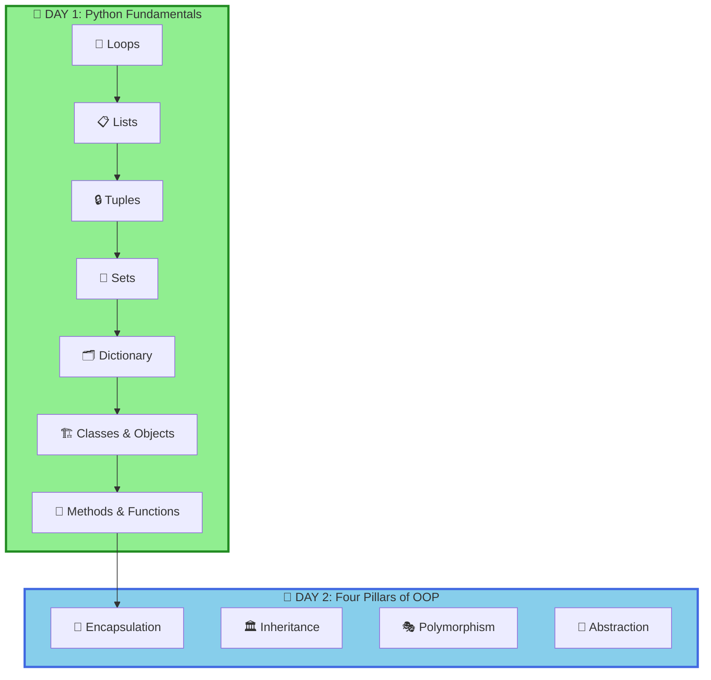

<div align="center">

# 🐍 Advance Python – NMIMS


### 🚀 *Master Python Fundamentals & Object-Oriented Programming!*

**Resource Link - https://canva.link/52roxdoar8i7rrl**

**Welcome to your comprehensive Python learning journey!**
Everything you need to become proficient in Python and master the core concepts of programming.

[📚 Topics Covered](#-day-1-topics) • [💻 Problems Solved](#-problems-covered---day-1) • [🎯 What's Next](#-day-2-four-pillars-of-oop)

---

</div>

## 📊 Learning Progress

```
Day 1 - Loops, Lists, Tuples, Sets, Dictionary & Class Objects:
████████████████████████████████ 100%

✅ Loops (for, while, nested loops, list comprehension)
✅ Lists - Creation, Append, Access & Methods
✅ Tuples - Immutable Sequences, Index, Count
✅ Sets - Unique Collections, Union, Intersection, Duplicates
✅ Dictionary - Key-Value Pairs, CRUD Operations
✅ Class & Objects - Constructors, Methods, Instances
✅ Static Methods & Instance Methods

Day 2 - Four Pillars of OOP:
░░░░░░░░░░░░░░░░░░░░░░░░░░░░░░░░ 0%

Coming Soon...
```

---

## 🗺️ Learning Path



---

# 📅 DAY 1: Python Fundamentals

## 📚 DAY 1 - Topics

<details open>
<summary><h3>🔄 Loops & Iterations</h3></summary>

> **Loop:** A programming construct that repeats a block of code multiple times based on a condition.
> **Iteration:** The process of executing the same code multiple times for different values.

### 1️⃣ **For Loops**

#### Creating Lists with For Loops

```python
# Create a list of squares from 1 to 10
arr = []
for i in range(1, 11):
    arr.append(i * i)

print(f"Array = {arr}")
# Output: Array = [1, 4, 9, 16, 25, 36, 49, 64, 81, 100]
```

#### Iterating with For Loop

```python
# Traditional iteration
fruits = ["Apple", "Banana", "Mango", "Orange"]

for fruit in fruits:
    print(fruit)

# Iteration with index
for i in range(len(fruits)):
    print(f"{i}: {fruits[i]}")
```

</details>

---

<details open>
<summary><h3>📦 Lists - Dynamic Arrays</h3></summary>

> **List:** An ordered, mutable collection of elements that can contain items of different data types.

### 2️⃣ **List Declaration & Operations**

#### 📊 Creating Lists

```python
# Empty list
empty_list = []

# List with initial values
numbers = [1, 2, 3, 4, 5]
mixed = [1, "hello", 3.14, True, None]
```

#### ➕ Adding Elements

```python
arr = []
arr.append(10)
arr.append(20)
arr.append(30)

print(arr)  # [10, 20, 30]
```

#### 🔍 Accessing Elements

```python
numbers = [10, 20, 30, 40, 50]

print(numbers[0])    # 10 (first element)
print(numbers[-1])   # 50 (last element)
print(numbers[2])    # 30
```

#### 📝 List Methods

```python
numbers = [1, 2, 3]
numbers2 = numbers  # Reference (same object)

numbers2.append(5)
numbers.append(90)

print(numbers)   # [1, 2, 3, 5, 90]
print(numbers2)  # [1, 2, 3, 5, 90]
```

</details>

---

<details open>
<summary><h3>🔒 Tuples - Immutable Sequences</h3></summary>

> **Tuple:** An immutable (unchangeable) ordered collection of elements. Once created, cannot be modified.

### 3️⃣ **Tuple Operations**

#### 📌 Tuple Creation & Access

```python
# Creating a tuple
a = (5, 7, 9, 8, 7)

print(type(a))       # <class 'tuple'>
print(a.index(7))    # 1 (index of first 7)
print(a.count(7))    # 2 (appears 2 times)
```

#### 🔄 Converting Tuple to List

```python
t = ("Z", "A", "R", "C")

# Sorted tuple (returns list)
print(sorted(t))  # ['A', 'C', 'R', 'Z']

# Convert to list, then sort
arr = list(t)
arr.sort()
print(arr)  # ['A', 'C', 'R', 'Z']
```

#### 📊 Tuple Processing Example

```python
tup = (32, 56, 775, 12, 11, 90, 97)

countEven = 0
countOdd = 0
evenList = []
oddList = []

for i in tup:
    if i % 2 == 0:
        countEven += 1
        evenList.append(i)
    else:
        countOdd += 1
        oddList.append(i)

print(f"Total Even Numbers = {countEven} which are {evenList}")
# Output: Total Even Numbers = 3 which are [32, 56, 12]

print(f"Total Odd Numbers = {countOdd} which are {oddList}")
# Output: Total Odd Numbers = 4 which are [775, 11, 90, 97]
```

</details>

---

<details open>
<summary><h3>🎯 Sets - Unique Collections</h3></summary>

> **Set:** An unordered collection of unique elements. Automatically removes duplicates.

### 4️⃣ **Set Operations**

#### ➕ Creating Sets & Basic Operations

```python
# Creating sets
setA = {1, 2, 2, 2, 3}    # Duplicates automatically removed
print(setA)               # {1, 2, 3}

setB = set()              # Empty set

setC = {53, 13, 567, 32, 78, 7, 90}
setC.pop()                # Removes arbitrary element

print(type(setB))         # <class 'set'>
```

#### 🔗 Set Operations - Union & Intersection

```python
setA = {1, 2, 3}
setB = {3, 4, 5}

print(setA.union(setB))           # {1, 2, 3, 4, 5}
print(setA.intersection(setB))     # {3}
```

#### 🔍 Removing Duplicates Using Sets

```python
# Method 1: Using Set with nested loop
arr = [3, 5, 7, 3, 9, 5, 3, 9]
dupSet = set()

for i in range(len(arr)):
    for j in range(i+1, len(arr)):
        if arr[i] == arr[j]:
            dupSet.add(arr[i])
            break

print(dupSet)  # {3, 5, 9}

# Method 2: Using visited set (optimized)
arr = [3, 5, 7, 3, 9, 5, 3, 9]
dupSet = []
visited = set()

for i in range(len(arr)):
    if arr[i] not in visited:
        visited.add(arr[i])
    else:
        dupSet.append(arr[i])

print(dupSet)  # [3, 5, 3, 9]
```

#### 📊 Real-world Example

```python
classRooms = {"C", "Java", "js", "Python", "C", "Python", "js"}
print(len(classRooms))  # 4 (unique subjects only)
# Output: {'C', 'Java', 'js', 'Python'}
```

</details>

---

<details open>
<summary><h3>🗂️ Dictionary - Key-Value Pairs</h3></summary>

> **Dictionary:** An unordered collection of key-value pairs. Keys must be unique and immutable.

### 5️⃣ **Dictionary Operations**

#### 📋 Creating Dictionaries

```python
myDict = {
    'name': "Shivam",
    'isTrainer': True,
    'price': 99,
    'marks': {
        'Java': 95,
        'Python': 92,
        'webDev': 99
    }
}
```

#### 🔍 Accessing Dictionary Values

```python
myDict = {
    'name': "Shivam",
    'isTrainer': True,
    'price': 99,
    'marks': {
        'Java': 95,
        'Python': 92,
        'webDev': 99
    }
}

# Accessing nested values
print(myDict['marks']['webDev'])  # 99

# Getting all keys
print(myDict.keys())              # dict_keys(['name', 'isTrainer', 'price', 'marks'])

# Getting all values
print(myDict.values())            # dict_values(['Shivam', True, 99, {...}])

# Getting key-value pairs
print(myDict.items())             # dict_items([('name', 'Shivam'), ...])

# Safe access with get()
print(myDict.get('names'))        # None (key doesn't exist)
```

#### ✏️ Updating Dictionary

```python
myDict.update({
    'name': "Mohini",
    'clgName': "NMIMS"
})

print(myDict)
# Output: {'name': 'Mohini', 'isTrainer': True, 'price': 99, 'clgName': 'NMIMS', ...}
```

#### 📊 Dictionary Examples

```python
# Creating dictionary with numbers
myDict = {}
for i in range(1, 11):
    myDict.update({i: i**2})

print(myDict)
# Output: {1: 1, 2: 4, 3: 9, 4: 16, 5: 25, 6: 36, 7: 49, 8: 64, 9: 81, 10: 100}

# Frequency counting
arr = [3, 5, 7, 3, 9, 5, 3, 9]
myDict = {}
for i in arr:
    if i not in myDict:
        myDict.update({i: 1})
    else:
        myDict.update({i: myDict.get(i) + 1})

print(myDict)
# Output: {3: 3, 5: 2, 7: 1, 9: 2}
```

</details>

---

<details open>
<summary><h3>🏗️ Classes & Objects - OOP Introduction</h3></summary>

> **Class:** A blueprint for creating objects with attributes and methods.
> **Object:** An instance of a class that holds specific data and behavior.

### 6️⃣ **Class Definition & Constructors**

#### 📌 Basic Class Structure

```python
# Simple class without constructor
class Student:
    trainerName = "Shivam Bansal"
    name = "Shreyas"

    def __init__(self):
        pass

s1 = Student()
print(s1.name)  # Shreyas
```

#### 🔧 Parameterized Constructor

```python
class Student:
    def __init__(self, name):
        self.fullName = name

s1 = Student("Shivam")
print(s1.fullName)  # Shivam

s2 = Student("Mohini")
print(s2.fullName)  # Mohini
```

#### 📝 Constructor with Default Values

```python
class Student:
    def __init__(self, name="anonymous"):
        self.name = name

s1 = Student("Shivam")
print(s1.name)  # Shivam

s2 = Student()
print(s2.name)  # anonymous
```

### 7️⃣ **Methods & Instance Operations**

#### 💡 Methods in Class

```python
class Student:
    def __init__(self, name, m1, m2, m3):
        self.name = name
        self.m1 = m1
        self.m2 = m2
        self.m3 = m3

    def getAvg(self):
        avg = (self.m1 + self.m2 + self.m3) / 3
        print(f"Average of {self.name} = {avg:.2f}")
        return avg

s1 = Student("Shivam", 91, 77, 11)
s1.getAvg()  # Average of Shivam = 59.67

s2 = Student("Mohini", 9, 10, 788)
s2.getAvg()  # Average of Mohini = 269.00
```

#### 🔷 Real-world Class Example

```python
class Circle:
    def __init__(self, radius):
        self.r = radius
    
    def getArea(self):
        area = (22/7) * self.r **2
        print(f"Area = {area:.2f}")

    def getPerimeter(self):
        perimeter = (22/7) * self.r **2
        print(f"Perimeter = {perimeter:.2f}")

c1 = Circle(4)
c1.getArea()       # Area = 50.29
c1.getPerimeter()  # Perimeter = 50.29
```

#### 🔒 Static Methods

```python
class Student:
    @staticmethod
    def welcome():
        print("Welcome Student")

s1 = Student()
s1.welcome()  # Welcome Student
```

</details>

---

## ✅ DAY 1 - Problems Covered

### 📋 **Loops & Lists**

| # | Problem | Difficulty | Concept | Status |
|:-:|:--------|:----------:|:--------|:------:|
| 1 | Create Array of Squares (1 to N) | 🟢 Easy | Loops & Lists | ✅ |
| 2 | List Referencing & Mutation | 🟢 Easy | List References | ✅ |
| 3 | Array Element Access & Assignment | 🟢 Easy | List Indexing | ✅ |

### 📌 **Tuples**

| # | Problem | Difficulty | Concept | Status |
|:-:|:--------|:----------:|:--------|:------:|
| 4 | Tuple Index & Count Methods | 🟢 Easy | Tuple Methods | ✅ |
| 5 | Sort Tuple using sorted() & list.sort() | 🟢 Easy | Sorting | ✅ |
| 6 | Tuple Traversal & Iteration | 🟢 Easy | Iteration | ✅ |
| 7 | Separate Even & Odd Numbers from Tuple | 🟢 Easy | Tuple Processing | ✅ |
| 8 | Count Even and Odd Elements | 🟢 Easy | Counting | ✅ |

### 🎯 **Sets**

| # | Problem | Difficulty | Concept | Status |
|:-:|:--------|:----------:|:--------|:------:|
| 9 | Create Set & Remove Duplicates with pop() | 🟢 Easy | Set Operations | ✅ |
| 10 | Set Union & Intersection Operations | 🟢 Easy | Set Methods | ✅ |
| 11 | Count Unique Elements (Duplicate Removal) | 🟢 Easy | Uniqueness | ✅ |
| 12 | Find Duplicates - Nested Loop with Set | 🟡 Medium | Nested Loops | ✅ |
| 13 | Find Duplicates - Array List Approach | 🟡 Medium | List Methods | ✅ |
| 14 | Find Duplicates - Visited Set (Optimized) | 🟡 Medium | Hash Set | ✅ |

### 🗂️ **Dictionary**

| # | Problem | Difficulty | Concept | Status |
|:-:|:--------|:----------:|:--------|:------:|
| 15 | Create Nested Dictionary | 🟢 Easy | Dictionary Basics | ✅ |
| 16 | Dictionary Access (keys(), values(), items(), get()) | 🟢 Easy | Dictionary Methods | ✅ |
| 17 | Dictionary Update Operations | 🟢 Easy | Dictionary Modification | ✅ |
| 18 | Dictionary with User Input | 🟢 Easy | Input Handling | ✅ |
| 19 | Create Dictionary with Computed Values | 🟢 Easy | Loop-based Creation | ✅ |
| 20 | Count Frequency of Array Elements | 🟡 Medium | Frequency Counting | ✅ |
| 21 | Frequency Map using Dictionary | 🟡 Medium | Dictionary Counting | ✅ |

### ⚙️ **Functions**

| # | Problem | Difficulty | Concept | Status |
|:-:|:--------|:----------:|:--------|:------:|
| 22 | Basic Function - Addition Function | 🟢 Easy | Function Definition | ✅ |

### 🏗️ **Object-Oriented Programming - Classes & Objects**

| # | Problem | Difficulty | Concept | Status |
|:-:|:--------|:----------:|:--------|:------:|
| 23 | Basic Class Structure with Class Variables | 🟢 Easy | Class Basics | ✅ |
| 24 | Class Instance Creation & Access | 🟢 Easy | Object Creation | ✅ |
| 25 | Non-Parameterized Constructor | 🟢 Easy | Constructor | ✅ |
| 26 | Parameterized Constructor | 🟢 Easy | Constructor Parameters | ✅ |
| 27 | Parameterized Constructor with Default Values | 🟢 Easy | Default Parameters | ✅ |
| 28 | Object Deletion (del keyword) | 🟢 Easy | Object Lifecycle | ✅ |
| 29 | Instance Methods in Class | 🟢 Easy | Methods | ✅ |
| 30 | Student Grades - Calculate Average | 🟡 Medium | Instance Variables | ✅ |
| 31 | Circle Class - Area & Perimeter Calculation | 🟡 Medium | Real-world Application | ✅ |
| 32 | Static Methods in Class | 🟢 Easy | Static Methods | ✅ |

---

<div align="center">

### 🌟 Keep Coding, Keep Growing! 🌟

---

### ✨ Remember: *Consistency > Intensity* ✨

Code every day, solve problems regularly, and success will follow!

---

<div align="center">

### ✨ Created By ✨

## <a href="https://whatsapp.com/channel/0029Vb74kBaL2ATzZBnRka19" target="_blank">✨ **Shine_Beyond_Syntax** ✨</a>

<br>

[](https://whatsapp.com/channel/0029Vb74kBaL2ATzZBnRka19)

<br>

</div>


</div>

---


