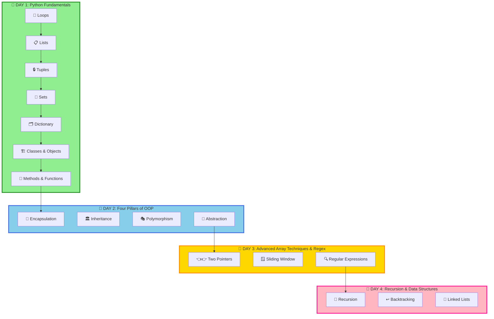

<div align="center">

# 🐍 Advance Python – NMIMS


### 🚀 *Crack DSA with Python – From Logic to Problem Solving!!!*

**Resource Link - <a href="https://canva.link/52roxdoar8i7rrl" target="_blank"  style="text-decoration: none">👋 Click Me</a>**

**Welcome to your comprehensive Python learning journey!**
Everything you need to become proficient in Python and master the core concepts of programming.

[📚 Topics Covered](#-day-1-topics) • [💻 Problems Solved](#-day-1---problems-covered) • [          🎯 Student's Work Call Stack Creation 🎯]()

---

</div>

## 📊 Learning Progress

```
Day 1 - Loops, Lists, Tuples, Sets, Dictionary & Class Objects:
████████████████████████████████ 100%

✅ Loops (for, while, nested loops, list comprehension)
✅ Lists - Creation, Append, Access & Methods
✅ Tuples - Immutable Sequences, Index, Count
✅ Sets - Unique Collections, Union, Intersection, Duplicates
✅ Dictionary - Key-Value Pairs, CRUD Operations
✅ Class & Objects - Constructors, Methods, Instances
✅ Static Methods & Instance Methods

Day 2 - Four Pillars of OOP:
████████████████████████████████ 100%

✅ Encapsulation - Data Hiding & Access Control
✅ Inheritance - Code Reusability & Type Hierarchy
✅ Polymorphism - Method Overriding & Same Interface
✅ Abstraction - Interface Definition & Implementation Hiding

Day 3 - Two Pointers, Sliding Window & Regular Expressions:
████████████████████████████████ 100%

✅ Two Pointers - Converging Pointers & Array Traversal
✅ Sliding Window - Dynamic Window & Optimal Subarray
✅ Regular Expressions - Pattern Matching & Text Processing

Day 4 - Recursion, Backtracking & Linked Lists:
████████████████████████████████ 100%

✅ Recursion - Function Calling Itself & Divide & Conquer
✅ Backtracking - Try & Revert Approach & Constraint Satisfaction
✅ Linked Lists - Node-based Data Structure & Pointer Manipulation
```

---

## 🗺️ Learning Path



---

# 📅 DAY 1: Python Fundamentals

## 📚 DAY 1 - Topics

<details open>
<summary><h3>🔄 Loops & Iterations</h3></summary>

> **Loop:** A programming construct that repeats a block of code multiple times based on a condition.
> **Iteration:** The process of executing the same code multiple times for different values.

### 1️⃣ **For Loops**

#### Creating Lists with For Loops

```python
# Create a list of squares from 1 to 10
arr = []
for i in range(1, 11):
    arr.append(i * i)

print(f"Array = {arr}")
# Output: Array = [1, 4, 9, 16, 25, 36, 49, 64, 81, 100]
```

#### Iterating with For Loop

```python
# Traditional iteration
fruits = ["Apple", "Banana", "Mango", "Orange"]

for fruit in fruits:
    print(fruit)

# Iteration with index
for i in range(len(fruits)):
    print(f"{i}: {fruits[i]}")
```

</details>

---

<details open>
<summary><h3>📦 Lists - Dynamic Arrays</h3></summary>

> **List:** An ordered, mutable collection of elements that can contain items of different data types.

### 2️⃣ **List Declaration & Operations**

#### 📊 Creating Lists

```python
# Empty list
empty_list = []

# List with initial values
numbers = [1, 2, 3, 4, 5]
mixed = [1, "hello", 3.14, True, None]
```

#### ➕ Adding Elements

```python
arr = []
arr.append(10)
arr.append(20)
arr.append(30)

print(arr)  # [10, 20, 30]
```

#### 🔍 Accessing Elements

```python
numbers = [10, 20, 30, 40, 50]

print(numbers[0])    # 10 (first element)
print(numbers[-1])   # 50 (last element)
print(numbers[2])    # 30
```

#### 📝 List Methods

```python
numbers = [1, 2, 3]
numbers2 = numbers  # Reference (same object)

numbers2.append(5)
numbers.append(90)

print(numbers)   # [1, 2, 3, 5, 90]
print(numbers2)  # [1, 2, 3, 5, 90]
```

</details>

---

<details open>
<summary><h3>🔒 Tuples - Immutable Sequences</h3></summary>

> **Tuple:** An immutable (unchangeable) ordered collection of elements. Once created, cannot be modified.

### 3️⃣ **Tuple Operations**

#### 📌 Tuple Creation & Access

```python
# Creating a tuple
a = (5, 7, 9, 8, 7)

print(type(a))       # <class 'tuple'>
print(a.index(7))    # 1 (index of first 7)
print(a.count(7))    # 2 (appears 2 times)
```

#### 🔄 Converting Tuple to List

```python
t = ("Z", "A", "R", "C")

# Sorted tuple (returns list)
print(sorted(t))  # ['A', 'C', 'R', 'Z']

# Convert to list, then sort
arr = list(t)
arr.sort()
print(arr)  # ['A', 'C', 'R', 'Z']
```

#### 📊 Tuple Processing Example

```python
tup = (32, 56, 775, 12, 11, 90, 97)

countEven = 0
countOdd = 0
evenList = []
oddList = []

for i in tup:
    if i % 2 == 0:
        countEven += 1
        evenList.append(i)
    else:
        countOdd += 1
        oddList.append(i)

print(f"Total Even Numbers = {countEven} which are {evenList}")
# Output: Total Even Numbers = 3 which are [32, 56, 12]

print(f"Total Odd Numbers = {countOdd} which are {oddList}")
# Output: Total Odd Numbers = 4 which are [775, 11, 90, 97]
```

</details>

---

<details open>
<summary><h3>🎯 Sets - Unique Collections</h3></summary>

> **Set:** An unordered collection of unique elements. Automatically removes duplicates.

### 4️⃣ **Set Operations**

#### ➕ Creating Sets & Basic Operations

```python
# Creating sets
setA = {1, 2, 2, 2, 3}    # Duplicates automatically removed
print(setA)               # {1, 2, 3}

setB = set()              # Empty set

setC = {53, 13, 567, 32, 78, 7, 90}
setC.pop()                # Removes arbitrary element

print(type(setB))         # <class 'set'>
```

#### 🔗 Set Operations - Union & Intersection

```python
setA = {1, 2, 3}
setB = {3, 4, 5}

print(setA.union(setB))           # {1, 2, 3, 4, 5}
print(setA.intersection(setB))     # {3}
```

#### 🔍 Removing Duplicates Using Sets

```python
# Method 1: Using Set with nested loop
arr = [3, 5, 7, 3, 9, 5, 3, 9]
dupSet = set()

for i in range(len(arr)):
    for j in range(i+1, len(arr)):
        if arr[i] == arr[j]:
            dupSet.add(arr[i])
            break

print(dupSet)  # {3, 5, 9}

# Method 2: Using visited set (optimized)
arr = [3, 5, 7, 3, 9, 5, 3, 9]
dupSet = []
visited = set()

for i in range(len(arr)):
    if arr[i] not in visited:
        visited.add(arr[i])
    else:
        dupSet.append(arr[i])

print(dupSet)  # [3, 5, 3, 9]
```

#### 📊 Real-world Example

```python
classRooms = {"C", "Java", "js", "Python", "C", "Python", "js"}
print(len(classRooms))  # 4 (unique subjects only)
# Output: {'C', 'Java', 'js', 'Python'}
```

</details>

---

<details open>
<summary><h3>🗂️ Dictionary - Key-Value Pairs</h3></summary>

> **Dictionary:** An unordered collection of key-value pairs. Keys must be unique and immutable.

### 5️⃣ **Dictionary Operations**

#### 📋 Creating Dictionaries

```python
myDict = {
    'name': "Shivam",
    'isTrainer': True,
    'price': 99,
    'marks': {
        'Java': 95,
        'Python': 92,
        'webDev': 99
    }
}
```

#### 🔍 Accessing Dictionary Values

```python
myDict = {
    'name': "Shivam",
    'isTrainer': True,
    'price': 99,
    'marks': {
        'Java': 95,
        'Python': 92,
        'webDev': 99
    }
}

# Accessing nested values
print(myDict['marks']['webDev'])  # 99

# Getting all keys
print(myDict.keys())              # dict_keys(['name', 'isTrainer', 'price', 'marks'])

# Getting all values
print(myDict.values())            # dict_values(['Shivam', True, 99, {...}])

# Getting key-value pairs
print(myDict.items())             # dict_items([('name', 'Shivam'), ...])

# Safe access with get()
print(myDict.get('names'))        # None (key doesn't exist)
```

#### ✏️ Updating Dictionary

```python
myDict.update({
    'name': "Mohini",
    'clgName': "NMIMS"
})

print(myDict)
# Output: {'name': 'Mohini', 'isTrainer': True, 'price': 99, 'clgName': 'NMIMS', ...}
```

#### 📊 Dictionary Examples

```python
# Creating dictionary with numbers
myDict = {}
for i in range(1, 11):
    myDict.update({i: i**2})

print(myDict)
# Output: {1: 1, 2: 4, 3: 9, 4: 16, 5: 25, 6: 36, 7: 49, 8: 64, 9: 81, 10: 100}

# Frequency counting
arr = [3, 5, 7, 3, 9, 5, 3, 9]
myDict = {}
for i in arr:
    if i not in myDict:
        myDict.update({i: 1})
    else:
        myDict.update({i: myDict.get(i) + 1})

print(myDict)
# Output: {3: 3, 5: 2, 7: 1, 9: 2}
```

</details>

---

<details open>
<summary><h3>🏗️ Classes & Objects - OOP Introduction</h3></summary>

> **Class:** A blueprint for creating objects with attributes and methods.
> **Object:** An instance of a class that holds specific data and behavior.

### 6️⃣ **Class Definition & Constructors**

#### 📌 Basic Class Structure

```python
# Simple class without constructor
class Student:
    trainerName = "Shivam Bansal"
    name = "Shreyas"

    def __init__(self):
        pass

s1 = Student()
print(s1.name)  # Shreyas
```

#### 🔧 Parameterized Constructor

```python
class Student:
    def __init__(self, name):
        self.fullName = name

s1 = Student("Shivam")
print(s1.fullName)  # Shivam

s2 = Student("Mohini")
print(s2.fullName)  # Mohini
```

#### 📝 Constructor with Default Values

```python
class Student:
    def __init__(self, name="anonymous"):
        self.name = name

s1 = Student("Shivam")
print(s1.name)  # Shivam

s2 = Student()
print(s2.name)  # anonymous
```

### 7️⃣ **Methods & Instance Operations**

#### 💡 Methods in Class

```python
class Student:
    def __init__(self, name, m1, m2, m3):
        self.name = name
        self.m1 = m1
        self.m2 = m2
        self.m3 = m3

    def getAvg(self):
        avg = (self.m1 + self.m2 + self.m3) / 3
        print(f"Average of {self.name} = {avg:.2f}")
        return avg

s1 = Student("Shivam", 91, 77, 11)
s1.getAvg()  # Average of Shivam = 59.67

s2 = Student("Mohini", 9, 10, 788)
s2.getAvg()  # Average of Mohini = 269.00
```

#### 🔷 Real-world Class Example

```python
class Circle:
    def __init__(self, radius):
        self.r = radius
    
    def getArea(self):
        area = (22/7) * self.r **2
        print(f"Area = {area:.2f}")

    def getPerimeter(self):
        perimeter = (22/7) * self.r **2
        print(f"Perimeter = {perimeter:.2f}")

c1 = Circle(4)
c1.getArea()       # Area = 50.29
c1.getPerimeter()  # Perimeter = 50.29
```

#### 🔒 Static Methods

```python
class Student:
    @staticmethod
    def welcome():
        print("Welcome Student")

s1 = Student()
s1.welcome()  # Welcome Student
```

</details>

---


## ✅ DAY 1 - Problems Covered

### 📋 **Loops & Lists**

| # | Problem | Difficulty | Concept | Status |
|:-:|:--------|:----------:|:--------|:------:|
| 1 | Create Array of Squares (1 to N) | 🟢 Easy | Loops & Lists | ✅ |
| 2 | List Referencing & Mutation | 🟢 Easy | List References | ✅ |
| 3 | Array Element Access & Assignment | 🟢 Easy | List Indexing | ✅ |

### 📌 **Tuples**

| # | Problem | Difficulty | Concept | Status |
|:-:|:--------|:----------:|:--------|:------:|
| 4 | Tuple Index & Count Methods | 🟢 Easy | Tuple Methods | ✅ |
| 5 | Sort Tuple using sorted() & list.sort() | 🟢 Easy | Sorting | ✅ |
| 6 | Tuple Traversal & Iteration | 🟢 Easy | Iteration | ✅ |
| 7 | Separate Even & Odd Numbers from Tuple | 🟢 Easy | Tuple Processing | ✅ |
| 8 | Count Even and Odd Elements | 🟢 Easy | Counting | ✅ |

### 🎯 **Sets**

| # | Problem | Difficulty | Concept | Status |
|:-:|:--------|:----------:|:--------|:------:|
| 9 | Create Set & Remove Duplicates with pop() | 🟢 Easy | Set Operations | ✅ |
| 10 | Set Union & Intersection Operations | 🟢 Easy | Set Methods | ✅ |
| 11 | Count Unique Elements (Duplicate Removal) | 🟢 Easy | Uniqueness | ✅ |
| 12 | Find Duplicates - Nested Loop with Set | 🟡 Medium | Nested Loops | ✅ |
| 13 | Find Duplicates - Array List Approach | 🟡 Medium | List Methods | ✅ |
| 14 | Find Duplicates - Visited Set (Optimized) | 🟡 Medium | Hash Set | ✅ |

### 🗂️ **Dictionary**

| # | Problem | Difficulty | Concept | Status |
|:-:|:--------|:----------:|:--------|:------:|
| 15 | Create Nested Dictionary | 🟢 Easy | Dictionary Basics | ✅ |
| 16 | Dictionary Access (keys(), values(), items(), get()) | 🟢 Easy | Dictionary Methods | ✅ |
| 17 | Dictionary Update Operations | 🟢 Easy | Dictionary Modification | ✅ |
| 18 | Dictionary with User Input | 🟢 Easy | Input Handling | ✅ |
| 19 | Create Dictionary with Computed Values | 🟢 Easy | Loop-based Creation | ✅ |
| 20 | Count Frequency of Array Elements | 🟡 Medium | Frequency Counting | ✅ |
| 21 | Frequency Map using Dictionary | 🟡 Medium | Dictionary Counting | ✅ |

### ⚙️ **Functions**

| # | Problem | Difficulty | Concept | Status |
|:-:|:--------|:----------:|:--------|:------:|
| 22 | Basic Function - Addition Function | 🟢 Easy | Function Definition | ✅ |

### 🏗️ **Object-Oriented Programming - Classes & Objects**

| # | Problem | Difficulty | Concept | Status |
|:-:|:--------|:----------:|:--------|:------:|
| 23 | Basic Class Structure with Class Variables | 🟢 Easy | Class Basics | ✅ |
| 24 | Class Instance Creation & Access | 🟢 Easy | Object Creation | ✅ |
| 25 | Non-Parameterized Constructor | 🟢 Easy | Constructor | ✅ |
| 26 | Parameterized Constructor | 🟢 Easy | Constructor Parameters | ✅ |
| 27 | Parameterized Constructor with Default Values | 🟢 Easy | Default Parameters | ✅ |
| 28 | Object Deletion (del keyword) | 🟢 Easy | Object Lifecycle | ✅ |
| 29 | Instance Methods in Class | 🟢 Easy | Methods | ✅ |
| 30 | Student Grades - Calculate Average | 🟡 Medium | Instance Variables | ✅ |
| 31 | Circle Class - Area & Perimeter Calculation | 🟡 Medium | Real-world Application | ✅ |
| 32 | Static Methods in Class | 🟢 Easy | Static Methods | ✅ |

---


# 📅 DAY 2: Four Pillars of OOP

## 📚 DAY 2 - Topics

<details open>
<summary><h3>📌 Encapsulation - Data Hiding</h3></summary>

> **Encapsulation:** Bundling data (variables) and methods (functions) together within a class while hiding internal details from the outside world. Uses access modifiers like private (__), protected (_), and public (no prefix).

### 1️⃣ **Private Attributes & Methods**

#### 🔐 Basic Encapsulation

```python
class Account:
    def __init__(self, accNum, accPass):
        self.accNum = accNum  # Public attribute
        self.__accPass = accPass  # Private attribute (name mangling)

    def __showPass(self):  # Private method
        return self.__accPass

    def getPass(self):  # Public method to access private data
        return self.__showPass()
```

#### 🛡️ Password Protection Example

```python
class Account:
    def __init__(self, accNum, accPass):
        self.accNum = accNum
        self.__accPass = accPass

    def __showPass(self):
        return self.__accPass

    def getPass(self):
        return self.__showPass()

    def changePassword(self):
        while True:
            oldPass = input("Enter your old Password: ")
            if(oldPass == self.getPass()):
                newPass = input("Enter your new Password: ")
                self.__accPass = newPass
                print("Password changed successfully!")
                break
            else:
                print("Wrong Password !!!")

a1 = Account(14380100115559, "Shivam@123")
print(a1.accNum)  # 14380100115559
# a1.__accPass  # AttributeError - Cannot access private attribute
a1.changePassword()
```

#### 💳 Banking System Example

```python
class Account:
    def __init__(self, name, bal):
        self.name = name
        self.balance = bal  # Could be made private for strict control

    def debit(self):
        amount = int(input("Enter the amount you want to debit = "))
        if(amount <= self.balance):
            self.balance -= amount
            print(f"Rs {amount} debited")
        else:
            print("Insufficient Balance")

    def credit(self, amount):
        self.balance += amount
        print(f"Rs {amount} credited")

    def showBalance(self):
        print(f"Balance = {self.balance}")

a1 = Account("Shivam", 34000)
a1.debit()         # Debit amount from account
a1.credit(10000)   # Credit amount to account
a1.showBalance()   # Display balance
```

### 🤔 **Key Questions on Encapsulation**

- Why do we need private attributes?
- What is the difference between private (__) and protected (_) attributes?
- How does Python's name mangling work?
- When should we use encapsulation?

</details>

---

<details open>
<summary><h3>🏛️ Inheritance - Code Reusability</h3></summary>

> **Inheritance:** A mechanism where a child class inherits properties and methods from a parent class, enabling code reusability and establishing a hierarchy.

### 2️⃣ **Types of Inheritance**

#### 1. **Single Level Inheritance**

```python
class Shape:
    color = "red"

class Triangle(Shape):
    sides = 3

t1 = Triangle()
print(t1.color)  # red (inherited from Shape)
print(t1.sides)  # 3
```

#### 2. **Multi-Level Inheritance**

```python
class Shape:
    color = "red"

class Triangle(Shape):
    sides = 3

class Isosceles(Triangle):
    degree = 180

i1 = Isosceles()
print(i1.color)   # red (from Shape, through Triangle)
print(i1.sides)   # 3 (from Triangle)
print(i1.degree)  # 180
```

#### 3. **Hierarchical Inheritance**

```python
class Shape:
    color = "red"

class Triangle(Shape):
    sides = 3

class Square(Shape):
    sides = 4

t1 = Triangle()
print(t1.color)   # red

s1 = Square()
print(s1.color)   # red (both Triangle and Square inherit from Shape)
```

#### 4. **Hybrid Inheritance**

```python
class Shape:
    color = "red"

class Triangle(Shape):
    sides = 3

class Square(Shape):
    sides = 4

class Isosceles(Triangle):
    degree = 180

# Isosceles inherits from Triangle, which inherits from Shape
# Square inherits directly from Shape
i1 = Isosceles()
print(i1.color)  # red

s1 = Square()
print(s1.color)  # red
```

#### 5. **Multiple Inheritance**

```python
class Mom:
    gender = "Female"

class Dad:
    gender = "Male"

class Me(Dad, Mom):  # Me inherits from both Dad and Mom
    sex = "M"

m1 = Me()
print(m1.gender)  # Male (takes from Dad as he is listed first)
```

### 🔄 **Method Overriding & super()**

```python
class Employee:
    def __init__(self, role, dept, salary):
        self.role = role
        self.department = dept
        self.salary = salary

    def showDetails(self):
        print(f"Role = {self.role}")
        print(f"Department = {self.department}")
        print(f"Salary = {self.salary}")

class Engineer(Employee):
    def __init__(self, name, age, role, dept, salary):
        self.name = name
        self.age = age
        super().__init__(role, dept, salary)  # Call parent constructor

    def showDetails(self):  # Override parent method
        print(f'Name = {self.name}')
        print(f'Age = {self.age}')
        super().showDetails()  # Call parent method

eng1 = Engineer("Shivam", 99, "Technical Trainer", "IT", 9999)
eng1.showDetails()

# Output:
# Name = Shivam
# Age = 99
# Role = Technical Trainer
# Department = IT
# Salary = 9999
```

### 🤔 **Key Questions on Inheritance**

- What is the difference between method overriding and method overloading?
- Why do we use the super() function?
- What are the advantages and disadvantages of multiple inheritance?
- What is the Diamond Problem?

</details>

---

<details open>
<summary><h3>🎭 Polymorphism - Many Forms</h3></summary>

> **Polymorphism:** The ability of objects to take multiple forms. Methods in different classes can have the same name but different implementations.

### 3️⃣ **Runtime Polymorphism**

#### 🐾 Animal Sound Example

```python
class Dog:
    def sound(self):
        print("Dog Barks")

class Cat:
    def sound(self):
        print("Cat Meows")

class Lion:
    def sound(self):
        print("Lion roars")

def makeSound(animal):
    animal.sound()

d1 = Dog()
c1 = Cat()
l1 = Lion()

makeSound(d1)  # Dog Barks
makeSound(c1)  # Cat Meows
makeSound(l1)  # Lion roars
```

#### 💡 **Why Polymorphism?**

The key benefit is that we can use the same method name (`sound()`) for different classes and let the object's type determine which method gets executed. This makes the code flexible and extensible.

### 🤔 **Key Questions on Polymorphism**

- What is the difference between compile-time and runtime polymorphism?
- How does Python achieve polymorphism without method overloading?
- What are the advantages of using polymorphism?
- Can we have polymorphism with inheritance?

</details>

---

<details open>
<summary><h3>🔽 Abstraction - Hide Complexity</h3></summary>

> **Abstraction:** The process of hiding complex implementation details and showing only the essential features. Achieved using Abstract Base Classes (ABC) and @abstractmethod decorator.

### 4️⃣ **Abstract Classes & Methods**

#### 🎯 Basic Abstraction

```python
from abc import ABC, abstractmethod

class Animal(ABC):
    @abstractmethod
    def walk(self):
        pass  # Method definition is hidden, implementation is enforced

class Dog(Animal):
    def walk(self):
        print("Can walk 4 legs")

class Hen(Animal):
    def walk(self):
        print("Can walk 2 legs")

d1 = Dog()
d1.walk()  # Can walk 4 legs

h1 = Hen()
h1.walk()  # Can walk 2 legs

# Animal()  # TypeError - Cannot instantiate abstract class
```

#### 🐄 Complex Example with Multiple Methods

```python
from abc import ABC, abstractmethod

class Animal(ABC):
    @abstractmethod
    def walk(self):
        pass
    
    @abstractmethod
    def sound(self):
        pass

class Cow(Animal):
    def sound(self):
        print("Cow Moos")

    def walk(self):
        print("Can walk 4 legs with 1 tail")

c1 = Cow()
c1.sound()  # Cow Moos
c1.walk()   # Can walk 4 legs with 1 tail
```

#### 🚗 Real-world Example: Vehicle System

```python
from abc import ABC, abstractmethod

class Vehicle(ABC):
    @abstractmethod
    def start(self):
        pass
    
    @abstractmethod
    def stop(self):
        pass

class Car(Vehicle):
    def start(self):
        print("Car engine started with key")
    
    def stop(self):
        print("Car engine stopped")

class Bike(Vehicle):
    def start(self):
        print("Bike engine started with kick")
    
    def stop(self):
        print("Bike engine stopped")

c1 = Car()
c1.start()  # Car engine started with key
c1.stop()   # Car engine stopped

b1 = Bike()
b1.start()  # Bike engine started with kick
b1.stop()   # Bike engine stopped
```

### 🤔 **Key Questions on Abstraction**

- What is the difference between abstract class and interface?
- Why cannot we instantiate an abstract class?
- What is the purpose of @abstractmethod decorator?
- How does abstraction help in designing large systems?

</details>

---


## 📚 DAY 2 - Problems Covered


### 📋 **Loops & Lists**

| # | Problem | Difficulty | Concept | Status |
|:-:|:--------|:----------:|:--------|:------:|
| 1 | Create Array of Squares (1 to N) | 🟢 Easy | Loops & Lists | ✅ |
| 2 | List Referencing & Mutation | 🟢 Easy | List References | ✅ |
| 3 | Array Element Access & Assignment | 🟢 Easy | List Indexing | ✅ |

### 📌 **Tuples**

| # | Problem | Difficulty | Concept | Status |
|:-:|:--------|:----------:|:--------|:------:|
| 4 | Tuple Index & Count Methods | 🟢 Easy | Tuple Methods | ✅ |
| 5 | Sort Tuple using sorted() & list.sort() | 🟢 Easy | Sorting | ✅ |
| 6 | Tuple Traversal & Iteration | 🟢 Easy | Iteration | ✅ |
| 7 | Separate Even & Odd Numbers from Tuple | 🟢 Easy | Tuple Processing | ✅ |
| 8 | Count Even and Odd Elements | 🟢 Easy | Counting | ✅ |

### 🎯 **Sets**

| # | Problem | Difficulty | Concept | Status |
|:-:|:--------|:----------:|:--------|:------:|
| 9 | Create Set & Remove Duplicates with pop() | 🟢 Easy | Set Operations | ✅ |
| 10 | Set Union & Intersection Operations | 🟢 Easy | Set Methods | ✅ |
| 11 | Count Unique Elements (Duplicate Removal) | 🟢 Easy | Uniqueness | ✅ |
| 12 | Find Duplicates - Nested Loop with Set | 🟡 Medium | Nested Loops | ✅ |
| 13 | Find Duplicates - Array List Approach | 🟡 Medium | List Methods | ✅ |
| 14 | Find Duplicates - Visited Set (Optimized) | 🟡 Medium | Hash Set | ✅ |

### 🗂️ **Dictionary**

| # | Problem | Difficulty | Concept | Status |
|:-:|:--------|:----------:|:--------|:------:|
| 15 | Create Nested Dictionary | 🟢 Easy | Dictionary Basics | ✅ |
| 16 | Dictionary Access (keys(), values(), items(), get()) | 🟢 Easy | Dictionary Methods | ✅ |
| 17 | Dictionary Update Operations | 🟢 Easy | Dictionary Modification | ✅ |
| 18 | Dictionary with User Input | 🟢 Easy | Input Handling | ✅ |
| 19 | Create Dictionary with Computed Values | 🟢 Easy | Loop-based Creation | ✅ |
| 20 | Count Frequency of Array Elements | 🟡 Medium | Frequency Counting | ✅ |
| 21 | Frequency Map using Dictionary | 🟡 Medium | Dictionary Counting | ✅ |

### ⚙️ **Functions**

| # | Problem | Difficulty | Concept | Status |
|:-:|:--------|:----------:|:--------|:------:|
| 22 | Basic Function - Addition Function | 🟢 Easy | Function Definition | ✅ |

### 🏗️ **Object-Oriented Programming - Classes & Objects**

| # | Problem | Difficulty | Concept | Status |
|:-:|:--------|:----------:|:--------|:------:|
| 23 | Basic Class Structure with Class Variables | 🟢 Easy | Class Basics | ✅ |
| 24 | Class Instance Creation & Access | 🟢 Easy | Object Creation | ✅ |
| 25 | Non-Parameterized Constructor | 🟢 Easy | Constructor | ✅ |
| 26 | Parameterized Constructor | 🟢 Easy | Constructor Parameters | ✅ |
| 27 | Parameterized Constructor with Default Values | 🟢 Easy | Default Parameters | ✅ |
| 28 | Object Deletion (del keyword) | 🟢 Easy | Object Lifecycle | ✅ |
| 29 | Instance Methods in Class | 🟢 Easy | Methods | ✅ |
| 30 | Student Grades - Calculate Average | 🟡 Medium | Instance Variables | ✅ |
| 31 | Circle Class - Area & Perimeter Calculation | 🟡 Medium | Real-world Application | ✅ |
| 32 | Static Methods in Class | 🟢 Easy | Static Methods | ✅ |

---


# 📅 DAY 3: Advanced Array Techniques & Regular Expressions

## 📚 DAY 3 - Topics

<details open>
<summary><h3>👈👉 Two Pointers - Array Convergence</h3></summary>

> **Two Pointers:** A technique that uses two pointers moving towards each other (converging) or in the same direction (fast-slow) to solve problems efficiently without extra space.

### 1️⃣ **Two Pointers Techniques**

#### 🔄 Converging Pointers - Palindrome Check

```python
# Method 1: Palindrome Check (Converging Pointers)
s = "racecar"
start = 0
end = len(s) - 1

isPalindrome = True
while start <= end:
    if s[start] != s[end]:
        isPalindrome = False
        break
    start += 1
    end -= 1

print(f"Is Palindrome: {isPalindrome}")  # True
```

#### 🔀 Parallel Pointers - Merge Two Sorted Arrays

```python
# Merge two sorted arrays using parallel pointers
a = [2, 5, 9, 12, 98]
b = [4, 8, 16]
sortedArr = []

i = 0
j = 0

while i < len(a) and j < len(b):
    if a[i] < b[j]:
        sortedArr.append(a[i])
        i += 1
    else:
        sortedArr.append(b[j])
        j += 1

# Add remaining elements from both arrays
while i < len(a):
    sortedArr.append(a[i])
    i += 1

while j < len(b):
    sortedArr.append(b[j])
    j += 1

print(sortedArr)  # [2, 4, 5, 8, 9, 12, 16, 98]
```

#### ⚡ Fast-Slow Pointers - Remove Duplicates from Sorted Array

```python
# Remove duplicates using fast-slow pointers (trigger-based)
arr = [1, 2, 2, 3, 5, 5, 6]

i = 0  # Slow pointer (position where unique element should be placed)
j = 1  # Fast pointer (scanning pointer)

while j < len(arr):
    if arr[i] != arr[j]:  # Found a new unique element
        i += 1
        arr[i] = arr[j]  # Place it at position i
    j += 1

print(arr[:i + 1])  # [1, 2, 3, 5, 6]
```

### 🤔 **Key Questions on Two Pointers**

- What is the difference between converging and parallel pointers?
- Why is two pointers more efficient than nested loops?
- What is the fast-slow pointer technique also known as?
- When should we use converging pointers vs parallel pointers?
- Can we use two pointers on unsorted arrays?
- What is the time and space complexity of two pointer approach?
- Explain the trigger-based pointer approach?
- Why does removing duplicates work with fast-slow pointers?

</details>

---

<details open>
<summary><h3>🪟 Sliding Window - Dynamic Window</h3></summary>

> **Sliding Window:** A technique that maintains a window of elements and slides it across the array to find optimal subarrays or substrings.

### 2️⃣ **Sliding Window Technique**

#### 📊 Maximum Sum Subarray of Size K

```python
# Find maximum sum of any subarray of size k
arr = [1, 4, 2, 10, 2, 3, 1, 0, 20]
k = 4

# Calculate sum of first window
window_sum = sum(arr[:k])
max_sum = window_sum

# Slide the window
for i in range(1, len(arr) - k + 1):
    window_sum = window_sum - arr[i - 1] + arr[i + k - 1]
    max_sum = max(max_sum, window_sum)

print(max_sum)  # 24 (subarray [3, 1, 0, 20])
```

#### 🔍 Longest Substring Without Repeating Characters

```python
# Find longest substring with all unique characters
s = "abcabcbb"
char_index = {}
max_length = 0
start = 0

for end in range(len(s)):
    if s[end] in char_index:
        start = max(start, char_index[s[end]] + 1)
    
    char_index[s[end]] = end
    max_length = max(max_length, end - start + 1)

print(max_length)  # 3 (substring "abc")
```

#### 🎪 Minimum Window Substring

```python
# Find minimum window substring containing all characters
s = "ADOBECODEBANC"
t = "ABC"

# Character frequency map for target
target_freq = {}
for char in t:
    target_freq[char] = target_freq.get(char, 0) + 1

required = len(target_freq)
formed = 0
window_counts = {}

min_length = float('inf')
min_start = 0
left = 0

for right in range(len(s)):
    char = s[right]
    window_counts[char] = window_counts.get(char, 0) + 1
    
    if char in target_freq and window_counts[char] == target_freq[char]:
        formed += 1
    
    while left <= right and formed == required:
        if right - left + 1 < min_length:
            min_length = right - left + 1
            min_start = left
        
        char = s[left]
        window_counts[char] -= 1
        if char in target_freq and window_counts[char] < target_freq[char]:
            formed -= 1
        left += 1

print(s[min_start:min_start + min_length])  # "BANC"
```

</details>

---

<details open>
<summary><h3>🔍 Regular Expressions - Pattern Matching</h3></summary>

> **Regular Expressions (Regex):** Powerful patterns used to match, search, and manipulate strings based on specific patterns.

### 3️⃣ **Regex Fundamentals**

#### 📝 Basic Pattern Matching

```python
import re

# Simple pattern matching
text = "Hello World 123"

# Match digits
digits = re.findall(r'\d', text)
print(digits)  # ['1', '2', '3']

# Match words
words = re.findall(r'\w+', text)
print(words)  # ['Hello', 'World', '123']

# Match specific pattern
match = re.search(r'World', text)
print(match.group())  # 'World'
```

#### 📧 Email Validation

```python
import re

emails = [
    "user@example.com",
    "invalid.email@",
    "another@domain.co.uk",
    "bad@.com"
]

pattern = r'^[a-zA-Z0-9._%+-]+@[a-zA-Z0-9.-]+\.[a-zA-Z]{2,}$'

for email in emails:
    if re.match(pattern, email):
        print(f"{email} ✅")
    else:
        print(f"{email} ❌")
```

#### 🌐 URL Extraction

```python
import re

text = "Visit https://example.com and http://test.org for more info"

urls = re.findall(r'https?://[^\s]+', text)
print(urls)  # ['https://example.com', 'http://test.org']
```

#### 🔢 Extract Numbers from Text

```python
import re

text = "The price is $25.99 and quantity is 100 items"

# Extract all numbers
numbers = re.findall(r'\d+\.?\d*', text)
print(numbers)  # ['25.99', '100']

# Extract integer prices
prices = re.findall(r'\$(\d+\.\d{2})', text)
print(prices)  # ['25.99']
```

#### 🔄 String Replacement with Regex

```python
import re

text = "Contact: john@example.com or jane@test.com"

# Replace emails with masked version
masked = re.sub(r'[\w.-]+@[\w.-]+', '[EMAIL]', text)
print(masked)  # "Contact: [EMAIL] or [EMAIL]"

# Replace multiple spaces with single space
text = "Hello    World    Test"
cleaned = re.sub(r'\s+', ' ', text)
print(cleaned)  # "Hello World Test"
```

#### 📋 Common Regex Patterns

```
\d      - Any digit (0-9)
\D      - Any non-digit
\w      - Word character (a-z, A-Z, 0-9, _)
\W      - Non-word character
\s      - Whitespace
\S      - Non-whitespace
.       - Any character except newline
^       - Start of string
$       - End of string
*       - Zero or more occurrences
+       - One or more occurrences
?       - Zero or one occurrence
{n}     - Exactly n occurrences
{n,m}   - Between n and m occurrences
[abc]   - Any of a, b, or c
[a-z]   - Range from a to z
(abc)   - Group
|       - Or operator
```

</details>

---

## ✅ DAY 3 - Problems Covered

### 👈👉 **Two Pointers**

| # | Problem | Difficulty | Concept | Status |
|:-:|:--------|:----------:|:--------|:------:|
| 1 | Palindrome Check - Converging Pointers (Method 1) | 🟢 Easy | Converging Pointers | ✅ |
| 2 | Palindrome Check - Converging Pointers (Method 2) | 🟢 Easy | String Validation | ✅ |
| 3 | Merge Two Sorted Arrays - Parallel Pointers | 🟡 Medium | Array Merging | ✅ |
| 4 | Remove Duplicates from Sorted Array - Fast/Slow Pointers | 🟡 Medium | In-place Operations | ✅ |
| 5 | Remove Duplicates with Uniqueness Check | 🟡 Medium | Trigger-based Pointers | ✅ |
| 6 | Maximum Average Subarray (Two Pointer Variant) | 🟡 Medium | Window Movement | ✅ |

### 🪟 **Sliding Window**

| # | Problem | Difficulty | Concept | Status |
|:-:|:--------|:----------:|:--------|:------:|
| 8 | Maximum Sum Subarray of Size K | 🟢 Easy | Basic Window | ✅ |
| 9 | Sliding Window - Find Maximum in Each Window | 🟡 Medium | Window Operations | ✅ |
| 10 | Longest Substring Without Repeating Characters | 🟡 Medium | Dynamic Window | ✅ |
| 11 | Longest Substring with K Distinct Characters | 🟡 Medium | Window Constraints | ✅ |
| 12 | Minimum Window Substring | 🟠 Hard | Complex Window | ✅ |
| 13 | Fruits into Baskets | 🟡 Medium | Window Optimization | ✅ |
| 14 | Average of Subarrays of Size K | 🟢 Easy | Window Average | ✅ |

### 🔍 **Regular Expressions**

| # | Problem | Difficulty | Concept | Status |
|:-:|:--------|:----------:|:--------|:------:|
| 15 | Email Validation using Regex | 🟡 Medium | Email Pattern | ✅ |
| 16 | URL Extraction from Text | 🟡 Medium | URL Pattern | ✅ |
| 17 | Phone Number Validation | 🟡 Medium | Phone Pattern | ✅ |
| 18 | Extract Numbers from String | 🟢 Easy | Digit Pattern | ✅ |
| 19 | Replace Patterns in Text | 🟢 Easy | String Substitution | ✅ |
| 20 | Remove HTML Tags from Text | 🟡 Medium | Tag Pattern | ✅ |
| 21 | Validate Password Strength | 🟡 Medium | Complex Pattern | ✅ |
| 22 | Split String by Pattern | 🟢 Easy | Regex Split | ✅ |
| 23 | Find All Matches in Text | 🟢 Easy | Pattern Matching | ✅ |
| 24 | Case Conversion with Regex | 🟢 Easy | Case Handling | ✅ |

---

# 📅 DAY 4: Recursion, Backtracking & Linked Lists

## � DAY 4 - Topics

<details open>
<summary><h3>🎯 Recursion - Function Calling Itself</h3></summary>

> **Recursion:** A programming technique where a function calls itself to solve a problem by breaking it down into smaller sub-problems. Every recursive function must have a base case to prevent infinite recursion.

### 1️⃣ **Recursion Fundamentals**

#### 📊 Print N to 1 (Decreasing Order)

```python
def printNum(n):
    if (n == 0):        # Base Case
        return
    
    print(n)            # Print before recursive call
    printNum(n - 1)     # Recursive Case

printNum(10)
# Output: 10 9 8 7 6 5 4 3 2 1
```

#### 🔢 Print 1 to N (Increasing Order)

```python
def printNum(i, n):
    if (i == n):        # Base Case
        return
    
    print(i)            # Print in increasing order
    printNum(i + 1, n)  # Recursive Case

n = int(input("Enter a num: "))
printNum(1, n + 1)
# Output: 1 2 3 ... n
```

#### ➕ Sum of N Natural Numbers

```python
def naturalSum(n):
    if (n == 0):        # Base Case
        return 0
    
    # Recursive formula: n + sum(n-1)
    return n + naturalSum(n - 1)

res = naturalSum(5)
print(res)              # 15 (1+2+3+4+5)
```

#### 🎓 Factorial Calculation

```python
def factorial(n):
    if (n == 0 or n == 1):  # Base Case
        return 1
    
    # Recursive formula: n * factorial(n-1)
    return n * factorial(n - 1)

res = factorial(5)
print(res)              # 120 (5*4*3*2*1)
```

#### 🔄 Permutation & Combination

```python
def factorial(n):
    if (n == 0 or n == 1):
        return 1
    return n * factorial(n - 1)

n = 5
r = 3

# Permutation P(n, r) = n! / (n-r)!
permutation = factorial(n) / factorial(n - r)
print(f"Permutation = {permutation}")  # 60

# Combination C(n, r) = n! / (r! * (n-r)!)
combination = factorial(n) / (factorial(r) * factorial(n - r))
print(f"Combination = {combination}")  # 10
```

#### 📈 Fibonacci Series

```python
def fibonacci(n):
    if n == 0:          # Base Case 1
        return 0
    
    if n == 1:          # Base Case 2
        return 1
    
    # Recursive formula: fib(n-1) + fib(n-2)
    return fibonacci(n - 1) + fibonacci(n - 2)

print("Fibonacci Series = ", end="")
for i in range(10):
    print(fibonacci(i), end=" ")
# Output: 0 1 1 2 3 5 8 13 21 34
```

### 🤔 **Key Questions on Recursion**

- What is a base case and why is it important?
- What is stack overflow and how does recursion relate to it?
- What are the advantages and disadvantages of recursion?
- How does recursion differ from iteration?
- What is memoization and when should it be used?
- Explain the call stack in recursion?

</details>

---

<details open>
<summary><h3>↩️ Backtracking - Try & Revert Approach</h3></summary>

> **Backtracking:** An algorithmic technique that considers searching every possible combination in hopes of finding a solution. It works by trying an option and backing up if it doesn't work out.

### 2️⃣ **Backtracking Techniques**

#### 🎯 N Queens Problem (Theory)

```
The N-Queens problem: Place N queens on an N×N chessboard such that
no two queens threaten each other (no two queens on same row, column,
or diagonal).

Key Concepts:
- Try placing a queen in each position
- Check if placement is valid (not attacked by existing queens)
- If valid, move to next row and try to place next queen
- If unable to place (dead end), backtrack to previous position
- Try alternative positions
```

#### 🗺️ Count Paths in a Maze

```python
def countPaths(i, j, n, m):
    # Dead End - out of bounds
    if (i == n or j == m):
        return 0
    
    # Reach Destination (bottom-right corner)
    if (i == n - 1 and j == m - 1):
        return 1
    
    # Right Path - move right
    rightPath = countPaths(i, j + 1, n, m)
    
    # Down Path - move down
    downPath = countPaths(i + 1, j, n, m)
    
    # Total paths = Right paths + Down paths
    return downPath + rightPath

n = m = 3
print(countPaths(0, 0, n, m))  # 6 (6 different paths in 3x3 maze)
```

**DRY RUN for 3×3 Maze:**
```
    From (0,0) to (2,2)
    Possible moves: Right or Down
    
    Paths:
    1. Right → Right → Down → Down
    2. Right → Down → Right → Down
    3. Right → Down → Down → Right
    4. Down → Right → Right → Down
    5. Down → Right → Down → Right
    6. Down → Down → Right → Right
```

### 🤔 **Key Questions on Backtracking**

- What is the difference between backtracking and recursion?
- When should we use backtracking over other approaches?
- What is pruning in backtracking?
- How do we determine if a state is valid in backtracking?
- What are the time and space complexities of backtracking?
- Give examples of problems that use backtracking?

</details>

---

<details open>
<summary><h3>🔗 Linked Lists - Node-based Data Structure</h3></summary>

> **Linked List:** A linear data structure consisting of nodes connected through pointers/references. Unlike arrays, linked lists don't require contiguous memory and allow dynamic memory allocation.

### 3️⃣ **Linked List Fundamentals**

#### 📌 Types of Linked Lists

```
1. Singly Linked List (SLL)
   - Each node has data and pointer to next node
   - Traversal is unidirectional (forward only)
   - Structure: [Data | Next] → [Data | Next] → [Data | None]

2. Doubly Linked List (DLL)
   - Each node has data, previous pointer, and next pointer
   - Traversal is bidirectional (forward and backward)
   - Structure: [Prev | Data | Next] ↔ [Prev | Data | Next]

3. Circular Linked List (CLL)
   - Last node points back to first node
   - Can be singly or doubly circular
   - Structure: [Data | Next] → [Data | Next] → (points to first)
```

#### 🏗️ Node Structure & Single Linked List Creation

```python
class Node:
    def __init__(self, data):
        self.data = data        # Data portion of node
        self.next = None        # Pointer to next node (initially None)

class LL:
    def printList(self):
        currentNode = firstNode
        
        while(currentNode != None):
            print(currentNode.data, end=" -> ")
            currentNode = currentNode.next
        
        print(None)

# Create nodes and link them
firstNode = Node(4)
firstNode.next = Node(10)
firstNode.next.next = Node(100)

# Print the linked list
list1 = LL()
list1.printList()
# Output: 4->10->100->None
```

#### 💡 **Brute Force Approach for Linked Lists**

```
In brute force approach:
- Create individual nodes manually
- Link them by setting next pointers
- Traverse the list to print/access data
- No dynamic insertion/deletion methods yet
- Basic understanding of node connections
```

### 🤔 **Key Questions on Linked Lists**

- Why use linked lists over arrays?
- What is the advantage of dynamic memory allocation?
- What is the difference between singly and doubly linked lists?
- How do we handle the head pointer in linked lists?
- What are the common operations on linked lists?
- Compare time complexities: Arrays vs Linked Lists?

</details>

---

## ✅ DAY 4 - Problems Covered

### 🎯 **Recursion Basics**

| # | Problem | Difficulty | Concept | Status |
|:-:|:--------|:----------:|:--------|:------:|
| 1 | Print N to 1 (Decreasing Order) | 🟢 Easy | Basic Recursion | ✅ |
| 2 | Print 1 to N (Increasing Order) | 🟢 Easy | Recursion with Parameters | ✅ |
| 3 | Sum of N Natural Numbers | 🟢 Easy | Recursive Accumulation | ✅ |
| 4 | Factorial Calculation | 🟢 Easy | Recursive Multiplication | ✅ |
| 5 | Permutation Calculation | 🟡 Medium | Using Factorial | ✅ |
| 6 | Combination Calculation | 🟡 Medium | Using Factorial | ✅ |
| 7 | Fibonacci Series Generation | 🟡 Medium | Multiple Base Cases | ✅ |

### ↩️ **Backtracking**

| # | Problem | Difficulty | Concept | Status |
|:-:|:--------|:----------:|:--------|:------:|
| 8 | N Queens Problem (Theory & Explanation) | 🟠 Hard | Constraint Satisfaction | ✅ |
| 9 | Count Paths in Maze (2D Grid) | 🟡 Medium | Backtracking on Grid | ✅ |
| 10 | DRY RUN for Maze Paths | 🟢 Easy | Step-by-step Execution | ✅ |

### 🔗 **Linked Lists Basics**

| # | Problem | Difficulty | Concept | Status |
|:-:|:--------|:----------:|:--------|:------:|
| 11 | Understand Linked List Types (SLL, DLL, CLL) | 🟢 Easy | LL Concepts | ✅ |
| 12 | Node Class Definition | 🟢 Easy | Node Structure | ✅ |
| 13 | Create Single Linked List (Manual Creation) | 🟡 Medium | Node Linking | ✅ |
| 14 | Print Linked List (Traversal) | 🟢 Easy | List Traversal | ✅ |
| 15 | Single Linked List - Brute Force Approach | 🟡 Medium | Manual Operations | ✅ |

---

# 📅 DAY 5: Stack and Queue

## 📚 DAY 5 - Topics

<details open>
<summary><h3>📚 Stack - LIFO Structure & Push-Pop Operations</h3></summary>

> **Stack:** A linear data structure that follows LIFO (Last In First Out) principle. The last element added is the first one to be removed. Elements are pushed (added) to the top and popped (removed) from the top.

### 1️⃣ **Stack Implementation & Basic Operations**

#### 🏗️ Stack Class Definition

```python
class Stack:
    def __init__(self):
        self.items = []  # Empty list to store stack elements
    
    def push(self, data):
        # Add element to top of stack
        self.items.append(data)
        print(f"Pushed {data}")
    
    def pop(self):
        # Remove and return top element
        if not self.isEmpty():
            return self.items.pop()
        else:
            print("Stack is empty!")
            return None
    
    def peek(self):
        # View top element without removing
        if not self.isEmpty():
            return self.items[-1]
        else:
            print("Stack is empty!")
            return None
    
    def isEmpty(self):
        # Check if stack is empty
        return len(self.items) == 0
    
    def display(self):
        # Print all stack elements
        if self.isEmpty():
            print("Stack is empty!")
        else:
            print(f"Stack: {self.items}")

# Example usage
s = Stack()
s.push(10)      # Pushed 10
s.push(20)      # Pushed 20
s.push(30)      # Pushed 30
s.display()     # Stack: [10, 20, 30]
print(f"Top element: {s.peek()}")  # Top element: 30
print(f"Popped: {s.pop()}")        # Popped: 30
s.display()     # Stack: [10, 20]
```

#### 🔄 Stack Operations Example

```python
s = Stack()

# Push multiple elements
elements = [5, 10, 15, 20, 25]
for elem in elements:
    s.push(elem)

print("Stack after pushing elements:")
s.display()  # Stack: [5, 10, 15, 20, 25]

# Pop operations
print(f"\nPopped: {s.pop()}")  # Popped: 25
print(f"\nPopped: {s.pop()}")  # Popped: 20
print(f"Peek: {s.peek()}")   # Peek: 15

print("\nStack after popping:")
s.display()  # Stack: [5, 10, 15]
```

### 2️⃣ **Valid Parentheses Using Stack**

#### ✅ Parentheses Matching

```python
def isValidParentheses(expr):
    # Stack to store opening brackets
    stack = []
    
    # Dictionary to match closing with opening brackets
    matching = {')': '(', '}': '{', ']': '['}
    
    for char in expr:
        if char in matching:  # Closing bracket
            if not stack or stack[-1] != matching[char]:
                return False
            stack.pop()  # Remove matching opening bracket
        elif char in matching.values():  # Opening bracket
            stack.append(char)
    
    # Valid if stack is empty (all brackets matched)
    return len(stack) == 0

# Test cases
expressions = [
    "()",           # Valid
    "([{}])",       # Valid
    "({[}])",       # Invalid
    "((()))",       # Valid
    "([)]",         # Invalid
]

for expr in expressions:
    result = isValidParentheses(expr)
    print(f"{expr}: {'✅ Valid' if result else '❌ Invalid'}")

# Output:
# (): ✅ Valid
# ([{}]): ✅ Valid
# ({[}]): ❌ Invalid
# ((())): ✅ Valid
# ([)]: ❌ Invalid
```

### 🤔 **Key Questions on Stack**

- What does LIFO stand for and how does it apply to stacks?
- What are the real-world applications of stacks?
- What is the time complexity of push, pop, and peek operations?
- How do we implement stack using linked lists?
- What is stack overflow and when does it occur?
- Explain how undo-redo functionality uses stacks?

</details>

---

<details open>
<summary><h3>🎪 Queue - FIFO Structure & Enqueue-Dequeue Operations</h3></summary>

> **Queue:** A linear data structure that follows FIFO (First In First Out) principle. The first element added is the first one to be removed. Elements are enqueued (added) to the rear and dequeued (removed) from the front.

### 3️⃣ **Queue Implementation**

#### 🚗 Queue Class Definition

```python
class Queue:
    def __init__(self):
        self.items = []  # List to store queue elements
    
    def enqueue(self, data):
        # Add element to rear of queue
        self.items.append(data)
        print(f"Enqueued {data}")
    
    def dequeue(self):
        # Remove and return front element
        if not self.isEmpty():
            return self.items.pop(0)
        else:
            print("Queue is empty!")
            return None
    
    def front(self):
        # View front element without removing
        if not self.isEmpty():
            return self.items[0]
        else:
            print("Queue is empty!")
            return None
    
    def isEmpty(self):
        # Check if queue is empty
        return len(self.items) == 0
    
    def display(self):
        # Print all queue elements
        if self.isEmpty():
            print("Queue is empty!")
        else:
            print(f"Queue: {self.items}")

# Example usage
q = Queue()
q.enqueue(10)   # Enqueued 10
q.enqueue(20)   # Enqueued 20
q.enqueue(30)   # Enqueued 30
q.display()     # Queue: [10, 20, 30]
print(f"Front element: {q.front()}")  # Front element: 10
print(f"Dequeued: {q.dequeue()}")     # Dequeued: 10
q.display()     # Queue: [20, 30]
```

#### 📊 Queue Operations Example

```python
q = Queue()

# Enqueue multiple elements
customers = ["Alice", "Bob", "Charlie", "David"]
for customer in customers:
    q.enqueue(customer)

print("Queue of customers:")
q.display()  # Queue: ['Alice', 'Bob', 'Charlie', 'David']

# Process customers (dequeue)
print(f"\nServing: {q.dequeue()}")  # Serving: Alice
print(f"Serving: {q.dequeue()}")  # Serving: Bob

print(f"\nNext customer: {q.front()}")  # Next customer: Charlie

print("\nRemaining queue:")
q.display()  # Queue: ['Charlie', 'David']
```

### 4️⃣ **Deque - Double-Ended Queue**

#### 🔀 Deque Implementation (Insert & Delete from Both Ends)

```python
class Deque:
    def __init__(self):
        self.items = []
    
    def insertFront(self, data):
        # Add element to front
        self.items.insert(0, data)
        print(f"Inserted {data} at front")
    
    def insertRear(self, data):
        # Add element to rear
        self.items.append(data)
        print(f"Inserted {data} at rear")
    
    def deleteFront(self):
        # Remove element from front
        if not self.isEmpty():
            return self.items.pop(0)
        else:
            print("Deque is empty!")
            return None
    
    def deleteRear(self):
        # Remove element from rear
        if not self.isEmpty():
            return self.items.pop()
        else:
            print("Deque is empty!")
            return None
    
    def isEmpty(self):
        return len(self.items) == 0
    
    def display(self):
        if self.isEmpty():
            print("Deque is empty!")
        else:
            print(f"Deque: {self.items}")

# Example usage
dq = Deque()
dq.insertRear(10)       # Inserted 10 at rear
dq.insertRear(20)       # Inserted 20 at rear
dq.insertFront(5)       # Inserted 5 at front
dq.insertFront(1)       # Inserted 1 at front
dq.display()            # Deque: [1, 5, 10, 20]

print(f"\nDeleted from front: {dq.deleteFront()}")  # Deleted from front: 1
print(f"Deleted from rear: {dq.deleteRear()}")     # Deleted from rear: 20

dq.display()            # Deque: [5, 10]
```

#### 🎯 Deque Operations Example

```python
dq = Deque()

# Build deque from both ends
dq.insertRear(100)
dq.insertRear(200)
dq.insertFront(50)
dq.insertFront(25)

print("Deque structure:")
dq.display()            # Deque: [25, 50, 100, 200]

# Process from both ends
print(f"\nFrom front: {dq.deleteFront()}")  # From front: 25
print(f"From rear: {dq.deleteRear()}")     # From rear: 200

dq.display()            # Deque: [50, 100]
```

### 🤔 **Key Questions on Queue & Deque**

- What is the difference between Queue and Stack?
- What does FIFO stand for and how does it apply to queues?
- What are practical applications of queues in real life?
- What is a Deque and when is it used?
- How is Deque different from Queue?
- What is the time complexity of queue operations?
- How do we optimize queue operations using circular arrays?
- Compare circular queue vs linear queue?

</details>

---

## ✅ DAY 5 - Problems Covered

### 📚 **Stack**

| # | Problem | Difficulty | Concept | Status |
|:-:|:--------|:----------:|:--------|:------:|
| 1 | Stack Class Implementation | 🟢 Easy | Stack Basics | ✅ |
| 2 | Push & Pop Operations | 🟢 Easy | Basic Operations | ✅ |
| 3 | Peek & isEmpty Methods | 🟢 Easy | Stack Utilities | ✅ |
| 4 | Display Stack Elements | 🟢 Easy | Traversal | ✅ |
| 5 | Valid Parentheses Checking | 🟡 Medium | Stack Application | ✅ |
| 6 | Balanced Brackets Validation | 🟡 Medium | Bracket Matching | ✅ |
| 7 | Stock Span Problem | 🟡 Medium | Stack Optimization | ✅ |
| 8 | Next Greater Element | 🟡 Medium | Stack Pattern | ✅ |
| 9 | Reverse String using Stack | 🟢 Easy | Stack Application | ✅ |
| 10 | Implement Stack using Linked List | 🟡 Medium | Advanced Implementation | ✅ |

### 🎪 **Queue & Deque**

| # | Problem | Difficulty | Concept | Status |
|:-:|:--------|:----------:|:--------|:------:|
| 11 | Queue Class Implementation | 🟢 Easy | Queue Basics | ✅ |
| 12 | Enqueue & Dequeue Operations | 🟢 Easy | Basic Operations | ✅ |
| 13 | Front & isEmpty Methods | 🟢 Easy | Queue Utilities | ✅ |
| 14 | Display Queue Elements | 🟢 Easy | Traversal | ✅ |
| 15 | Deque Implementation | 🟡 Medium | Double-ended Queue | ✅ |
| 16 | Insert from Both Ends | 🟡 Medium | Deque Operations | ✅ |
| 17 | Delete from Both Ends | 🟡 Medium | Deque Operations | ✅ |
| 18 | Circular Queue Implementation | 🟡 Medium | Optimized Queue | ✅ |
| 19 | Generate Numbers with Given Digits | 🟡 Medium | Queue Application | ✅ |
| 20 | First Non-Repeating Character | 🟡 Medium | Queue Pattern | ✅ |

---

# 📅 DAY 6: Dynamic Programming

## 📚 DAY 6 - Topics

<details open>
<summary><h3>💾 Memoization - Storing Computed Results & Reusability</h3></summary>

> **Memoization:** An optimization technique where we store (cache) the results of expensive function calls and return the cached result when the same inputs occur again. It's a top-down approach to dynamic programming.

### 1️⃣ **Memoization Fundamentals**

#### 🔄 Fibonacci Without Memoization (Exponential Time)

```python
def fibonacci(n):
    # Base cases
    if n == 0:
        return 0
    if n == 1:
        return 1
    
    # Recursive formula: fib(n) = fib(n-1) + fib(n-2)
    return fibonacci(n - 1) + fibonacci(n - 2)

# Example
print(fibonacci(5))  # 5 (0, 1, 1, 2, 3, 5)
# Time Complexity: O(2^n) - exponential, very slow!
# Recalculates same values many times
```

#### 💾 Fibonacci With Memoization (Linear Time)

```python
def fibonacciMemo(n, memo={}):
    # Base cases
    if n == 0:
        return 0
    if n == 1:
        return 1
    
    # Check if result already computed (memoized)
    if n in memo:
        print(f"Returning cached result for {n}")
        return memo[n]
    
    # Compute and store result in memo
    memo[n] = fibonacciMemo(n - 1, memo) + fibonacciMemo(n - 2, memo)
    return memo[n]

# Example
memo = {}
print(fibonacciMemo(6, memo))  # 8
# Time Complexity: O(n) - linear, much faster!
# Each value computed only once
```

#### ⏱️ Performance Comparison

```python
import time

def fibonacci(n):
    if n == 0:
        return 0
    if n == 1:
        return 1
    return fibonacci(n - 1) + fibonacci(n - 2)

def fibonacciMemo(n, memo={}):
    if n == 0:
        return 0
    if n == 1:
        return 1
    if n in memo:
        return memo[n]
    memo[n] = fibonacciMemo(n - 1, memo) + fibonacciMemo(n - 2, memo)
    return memo[n]

n = 35

# Without memoization
start = time.time()
result1 = fibonacci(n)
end = time.time()
print(f"Without Memoization: {result1}, Time: {end - start:.4f}s")  # ~5s

# With memoization
start = time.time()
result2 = fibonacciMemo(n)
end = time.time()
print(f"With Memoization: {result2}, Time: {end - start:.4f}s")     # ~0.0001s
```

### 🤔 **Key Questions on Memoization**

- What is the difference between memoization and caching?
- Why is memoization more efficient than naive recursion?
- When should we use memoization?
- What is the space-time tradeoff in memoization?
- Can memoization be applied to all problems?

</details>

---

<details open>
<summary><h3>📊 Tabulation - Bottom-up Approach & Space Optimization</h3></summary>

> **Tabulation:** A bottom-up dynamic programming approach where we start solving from the base cases and build up to the final solution using iteration. It avoids recursion overhead and is generally more efficient.

### 2️⃣ **Tabulation Technique**

#### 🔢 Fibonacci Using Tabulation (Iterative)

```python
def fibonacciTabulation(n):
    # Create a table to store results
    if n == 0:
        return 0
    if n == 1:
        return 1
    
    # dp[i] will store fibonacci(i)
    dp = [0] * (n + 1)
    dp[0] = 0
    dp[1] = 1
    
    # Fill table from bottom up
    for i in range(2, n + 1):
        dp[i] = dp[i - 1] + dp[i - 2]
    
    return dp[n]

# Example
print(fibonacciTabulation(10))  # 55
# Time Complexity: O(n)
# Space Complexity: O(n)
```

#### 🎯 Space-Optimized Tabulation

```python
def fibonacciOptimized(n):
    # Only store last two values
    if n == 0:
        return 0
    if n == 1:
        return 1
    
    prev2 = 0
    prev1 = 1
    
    for i in range(2, n + 1):
        current = prev1 + prev2
        prev2 = prev1
        prev1 = current
    
    return prev1

# Example
result = fibonacciOptimized(10)  # 55
print(f"Fibonacci(10) = {result}")
# Time Complexity: O(n)
# Space Complexity: O(1) - Only constant space!
```

#### 📈 Tabulation Example - Coin Change

```python
def minCoins(coins, target):
    # dp[i] = minimum coins needed to make amount i
    dp = [float('inf')] * (target + 1)
    dp[0] = 0  # 0 coins needed for amount 0
    
    for amount in range(1, target + 1):
        for coin in coins:
            if coin <= amount:
                dp[amount] = min(dp[amount], dp[amount - coin] + 1)
    
    return dp[target] if dp[target] != float('inf') else -1

# Example
coins = [1, 2, 5]
target = 5
print(f"Minimum coins for {target}: {minCoins(coins, target)}")  # 1 (coin: 5)

coins = [2]
target = 3
print(f"Minimum coins for {target}: {minCoins(coins, target)}")  # -1 (impossible)
```

### 🤔 **Key Questions on Tabulation**

- What is the difference between memoization and tabulation?
- Why is tabulation sometimes better than memoization?
- What is the space optimization technique in DP?
- How do we identify which DP approach to use?
- What are the advantages of iterative DP?

</details>

---

<details open>
<summary><h3>🎯 Classic DP Problems - Theory & Approach</h3></summary>

> **Classic DP Problems:** Common problems where dynamic programming provides optimal solutions by breaking them into overlapping subproblems.

### 3️⃣ **DP Problem Patterns**

#### 🪙 Coin Change Problem

```
Problem: Find minimum number of coins needed to make a given amount
Approach:
1. State: dp[i] = minimum coins to make amount i
2. Transition: For each coin, update: dp[i] = min(dp[i], dp[i-coin] + 1)
3. Base Case: dp[0] = 0 (0 coins for amount 0)
4. Time Complexity: O(amount * coins)
5. Space Complexity: O(amount)
```

#### 📜 Longest Common Subsequence (LCS)

```
Problem: Find the longest subsequence common to two sequences
Approach:
1. State: dp[i][j] = length of LCS of first i chars and first j chars
2. Transition:
   - If s1[i-1] == s2[j-1]: dp[i][j] = dp[i-1][j-1] + 1
   - Else: dp[i][j] = max(dp[i-1][j], dp[i][j-1])
3. Base Case: dp[0][j] = 0, dp[i][0] = 0
4. Time Complexity: O(m*n) where m, n are string lengths
5. Space Complexity: O(m*n)

Example: LCS("ABCDGH", "AEDFHR") = "ADH" (length 3)
```

#### 🎒 0/1 Knapsack Problem

```
Problem: Select items with maximum value without exceeding weight limit
Approach:
1. State: dp[i][w] = max value using first i items with weight limit w
2. Transition: For each item, either include it or exclude it
   - dp[i][w] = max(dp[i-1][w], dp[i-1][w-weight[i]] + value[i])
3. Base Case: dp[0][w] = 0 (no items, no value)
4. Time Complexity: O(n*W) where n is items, W is capacity
5. Space Complexity: O(n*W)

Example: Items [(value=60,weight=10), (value=100,weight=20)]
         Capacity=30 → Maximum value = 160 (include both)
```

### 🤔 **Key Questions on Classic DP Problems**

- What makes a problem suitable for DP?
- How do we identify overlapping subproblems?
- What is the difference between coin change and knapsack?
- How does LCS relate to edit distance?
- What is the recurrence relation in each problem?

</details>

---

## ✅ DAY 6 - Problems Covered

### 💾 **Memoization**

| # | Problem | Difficulty | Concept | Status |
|:-:|:--------|:----------:|:--------|:------:|
| 1 | Fibonacci Without Memoization | 🟢 Easy | Exponential Recursion | ✅ |
| 2 | Fibonacci With Memoization | 🟡 Medium | Caching Results | ✅ |
| 3 | Performance Comparison (With vs Without) | 🟡 Medium | Optimization | ✅ |
| 4 | Factorial with Memoization | 🟢 Easy | Simple Memoization | ✅ |
| 5 | Climbing Stairs with Memoization | 🟡 Medium | Path Counting | ✅ |

### 📊 **Tabulation**

| # | Problem | Difficulty | Concept | Status |
|:-:|:--------|:----------:|:--------|:------:|
| 6 | Fibonacci Using Tabulation | 🟡 Medium | Bottom-up DP | ✅ |
| 7 | Space-Optimized Fibonacci | 🟡 Medium | Space Optimization | ✅ |
| 8 | Minimum Coins for Amount | 🟡 Medium | Coin Change | ✅ |
| 9 | Climbing Stairs with Tabulation | 🟡 Medium | Iterative Approach | ✅ |
| 10 | House Robber Problem | 🟡 Medium | DP Pattern | ✅ |

### 🎯 **Classic DP Problems**

| # | Problem | Difficulty | Concept | Status |
|:-:|:--------|:----------:|:--------|:------:|
| 11 | Coin Change Problem | 🟠 Hard | Greedy DP | ✅ |
| 12 | Longest Common Subsequence (LCS) | 🟠 Hard | String DP | ✅ |
| 13 | 0/1 Knapsack Problem | 🟠 Hard | Selection DP | ✅ |
| 14 | Edit Distance (Levenshtein) | 🟠 Hard | String Transformation | ✅ |
| 15 | Maximum Subarray Sum (Kadane's) | 🟡 Medium | Subarray DP | ✅ |
| 16 | Longest Increasing Subsequence | 🟡 Medium | Sequence DP | ✅ |
| 17 | Rod Cutting Problem | 🟠 Hard | Optimization DP | ✅ |

---

# 📅 DAY 7: Searching & Sorting

## 📚 DAY 7 - Topics

<details open>
<summary><h3>🔍 Linear Search - Sequential Traversal & O(n) Complexity</h3></summary>

> **Linear Search:** A basic searching algorithm that sequentially checks every element in the array until the target element is found or the array ends. Simple but not efficient for large datasets.

### 1️⃣ **Linear Search Implementation**

#### 📍 Basic Linear Search

```python
def linearSearch(arr, target):
    # Traverse through every element
    for i in range(len(arr)):
        if arr[i] == target:
            return i  # Element found, return index
    
    return -1  # Element not found

# Example
arr = [10, 25, 30, 45, 50, 75, 80]
target = 45

result = linearSearch(arr, target)
print(f"Element found at index: {result}")  # 3
print(f"Element value: {arr[result]}")      # 45

# Not found
result = linearSearch(arr, 100)
print(f"Search result: {result}")           # -1 (not found)
```

#### 🔢 Count Occurrences

```python
def countOccurrences(arr, target):
    count = 0
    
    for i in range(len(arr)):
        if arr[i] == target:
            count += 1
    
    return count

# Example
arr = [1, 2, 3, 2, 4, 2, 5, 2]
target = 2

count = countOccurrences(arr, target)
print(f"'{target}' appears {count} times")  # 4 times
```

#### 🎯 Find All Indices

```python
def findAllIndices(arr, target):
    indices = []
    
    for i in range(len(arr)):
        if arr[i] == target:
            indices.append(i)
    
    return indices

# Example
arr = [10, 20, 10, 30, 10, 40]
target = 10

indices = findAllIndices(arr, target)
print(f"Indices of {target}: {indices}")  # [0, 2, 4]
```

### 🤔 **Key Questions on Linear Search**

- What is the time complexity of linear search?
- When should we use linear search instead of binary search?
- What is the best and worst case for linear search?
- How does linear search work on unsorted arrays?
- What are the practical applications of linear search?

</details>

---

<details open>
<summary><h3>⚡ Binary Search - Divide & Conquer & O(log n) Complexity</h3></summary>

> **Binary Search:** An efficient searching algorithm that works on sorted arrays by dividing the search space in half at each step. Time complexity O(log n) makes it much faster than linear search.

### 2️⃣ **Binary Search Implementation**

#### 🎯 Binary Search - Iterative Approach

```python
def binarySearch(arr, target):
    left = 0
    right = len(arr) - 1
    
    while left <= right:
        mid = (left + right) // 2  # Find middle index
        
        if arr[mid] == target:
            return mid  # Found
        elif arr[mid] < target:
            left = mid + 1  # Search right half
        else:
            right = mid - 1  # Search left half
    
    return -1  # Not found

# Example
arr = [10, 20, 30, 40, 50, 60, 70, 80, 90]
target = 50

result = binarySearch(arr, target)
print(f"Element found at index: {result}")  # 4

target = 25
result = binarySearch(arr, target)
print(f"Element not found: {result}")       # -1
```

#### 🔄 Binary Search - Recursive Approach

```python
def binarySearchRecursive(arr, target, left, right):
    if left > right:
        return -1  # Not found
    
    mid = (left + right) // 2
    
    if arr[mid] == target:
        return mid
    elif arr[mid] < target:
        return binarySearchRecursive(arr, target, mid + 1, right)
    else:
        return binarySearchRecursive(arr, target, left, mid - 1)

# Example
arr = [2, 5, 8, 12, 16, 23, 38, 45, 56]
target = 23

result = binarySearchRecursive(arr, target, 0, len(arr) - 1)
print(f"Element found at index: {result}")  # 5
```

#### 🔍 First & Last Occurrence

```python
def findFirst(arr, target):
    # Find first occurrence of target
    left, right = 0, len(arr) - 1
    result = -1
    
    while left <= right:
        mid = (left + right) // 2
        if arr[mid] == target:
            result = mid
            right = mid - 1  # Continue searching left
        elif arr[mid] < target:
            left = mid + 1
        else:
            right = mid - 1
    
    return result

def findLast(arr, target):
    # Find last occurrence of target
    left, right = 0, len(arr) - 1
    result = -1
    
    while left <= right:
        mid = (left + right) // 2
        if arr[mid] == target:
            result = mid
            left = mid + 1  # Continue searching right
        elif arr[mid] < target:
            left = mid + 1
        else:
            right = mid - 1
    
    return result

# Example
arr = [1, 2, 2, 2, 3, 4, 4, 5]
target = 2

print(f"First occurrence: {findFirst(arr, target)}")  # 1
print(f"Last occurrence: {findLast(arr, target)}")    # 3
```

### 🤔 **Key Questions on Binary Search**

- Why must the array be sorted for binary search?
- What is the time complexity and why is it O(log n)?
- How many steps are needed for an array of 1 million elements?
- What is the difference between iterative and recursive binary search?
- When should we use binary search variants like first/last occurrence?

</details>

---

<details open>
<summary><h3>🔀 Sorting Algorithms - Bubble, Insertion, Quick, Merge, Counting Sort</h3></summary>

> **Sorting:** The process of arranging elements in a specific order (ascending or descending). Different algorithms have different time and space complexities.

### 3️⃣ **Sorting Techniques**

#### 🫧 Bubble Sort (O(n²))

```python
def bubbleSort(arr):
    n = len(arr)
    
    # Traverse through all array elements
    for i in range(n):
        swapped = False
        
        # Last i elements already in place
        for j in range(0, n - i - 1):
            if arr[j] > arr[j + 1]:
                # Swap if element is greater than next
                arr[j], arr[j + 1] = arr[j + 1], arr[j]
                swapped = True
        
        # If no swaps, array is sorted
        if not swapped:
            break
    
    return arr

# Example
arr = [64, 34, 25, 12, 22, 11, 90]
result = bubbleSort(arr.copy())
print(f"Sorted: {result}")  # [11, 12, 22, 25, 34, 64, 90]
# Time Complexity: O(n²), Space Complexity: O(1)
```

#### 📍 Insertion Sort (O(n²))

```python
def insertionSort(arr):
    # Start from second element
    for i in range(1, len(arr)):
        key = arr[i]
        j = i - 1
        
        # Move elements greater than key one position ahead
        while j >= 0 and arr[j] > key:
            arr[j + 1] = arr[j]
            j -= 1
        
        arr[j + 1] = key
    
    return arr

# Example
arr = [64, 34, 25, 12, 22, 11, 90]
result = insertionSort(arr.copy())
print(f"Sorted: {result}")  # [11, 12, 22, 25, 34, 64, 90]
# Time Complexity: O(n²), Space Complexity: O(1)
```

#### ⚡ Quick Sort (O(n log n) average)

```python
def quickSort(arr, low=0, high=None):
    if high is None:
        high = len(arr) - 1
    
    if low < high:
        # Partition and get pivot index
        pivot_index = partition(arr, low, high)
        
        # Recursively sort left and right partitions
        quickSort(arr, low, pivot_index - 1)
        quickSort(arr, pivot_index + 1, high)
    
    return arr

def partition(arr, low, high):
    # Choose pivot (last element)
    pivot = arr[high]
    i = low - 1
    
    for j in range(low, high):
        if arr[j] < pivot:
            i += 1
            arr[i], arr[j] = arr[j], arr[i]
    
    arr[i + 1], arr[high] = arr[high], arr[i + 1]
    return i + 1

# Example
arr = [64, 34, 25, 12, 22, 11, 90]
result = quickSort(arr.copy())
print(f"Sorted: {result}")  # [11, 12, 22, 25, 34, 64, 90]
# Time Complexity: O(n log n) average, Space Complexity: O(log n)
```

#### 🔀 Merge Sort (O(n log n))

```python
def mergeSort(arr):
    if len(arr) <= 1:
        return arr
    
    # Divide array into halves
    mid = len(arr) // 2
    left = mergeSort(arr[:mid])
    right = mergeSort(arr[mid:])
    
    # Merge sorted halves
    return merge(left, right)

def merge(left, right):
    result = []
    i = j = 0
    
    while i < len(left) and j < len(right):
        if left[i] < right[j]:
            result.append(left[i])
            i += 1
        else:
            result.append(right[j])
            j += 1
    
    result.extend(left[i:])
    result.extend(right[j:])
    return result

# Example
arr = [64, 34, 25, 12, 22, 11, 90]
result = mergeSort(arr)
print(f"Sorted: {result}")  # [11, 12, 22, 25, 34, 64, 90]
# Time Complexity: O(n log n), Space Complexity: O(n)
```

#### 🔢 Counting Sort (O(n+k))

```python
def countingSort(arr, maxVal=None):
    if not arr:
        return arr
    
    if maxVal is None:
        maxVal = max(arr)
    
    # Create count array
    count = [0] * (maxVal + 1)
    
    # Count occurrences
    for num in arr:
        count[num] += 1
    
    # Rebuild sorted array
    index = 0
    for i in range(len(count)):
        for _ in range(count[i]):
            arr[index] = i
            index += 1
    
    return arr

# Example
arr = [4, 2, 3, 1, 5, 2, 3, 4]
result = countingSort(arr.copy())
print(f"Sorted: {result}")  # [1, 2, 2, 3, 3, 4, 4, 5]
# Time Complexity: O(n+k), Space Complexity: O(k)
```

### 🤔 **Key Questions on Sorting**

- What is the difference between stable and unstable sorts?
- When should we use each sorting algorithm?
- What is time and space complexity for each algorithm?
- Why is merge sort O(n log n) in all cases?
- When is counting sort useful and what are its limitations?
- How does quick sort's performance vary with pivot choice?

</details>

---

## ✅ DAY 7 - Problems Covered

### 🔍 **Linear Search**

| # | Problem | Difficulty | Concept | Status |
|:-:|:--------|:----------:|:--------|:------:|
| 1 | Basic Linear Search | 🟢 Easy | Sequential Search | ✅ |
| 2 | Search in Unsorted Array | 🟢 Easy | Finding Element | ✅ |
| 3 | Count Occurrences | 🟢 Easy | Counting Matches | ✅ |
| 4 | Find All Indices | 🟢 Easy | Multiple Occurrences | ✅ |
| 5 | Search Minimum/Maximum | 🟢 Easy | Extrema Finding | ✅ |

### ⚡ **Binary Search**

| # | Problem | Difficulty | Concept | Status |
|:-:|:--------|:----------:|:--------|:------:|
| 6 | Binary Search - Iterative | 🟡 Medium | Basic Binary Search | ✅ |
| 7 | Binary Search - Recursive | 🟡 Medium | Recursive Approach | ✅ |
| 8 | First Occurrence | 🟡 Medium | Leftmost Position | ✅ |
| 9 | Last Occurrence | 🟡 Medium | Rightmost Position | ✅ |
| 10 | Search Insert Position | 🟡 Medium | Modified Binary Search | ✅ |
| 11 | Peak Element Finding | 🟡 Medium | Binary Search Variant | ✅ |

### 🔀 **Sorting Algorithms**

| # | Problem | Difficulty | Concept | Status |
|:-:|:--------|:----------:|:--------|:------:|
| 12 | Bubble Sort Implementation | 🟢 Easy | Basic Sorting | ✅ |
| 13 | Insertion Sort Implementation | 🟢 Easy | Incremental Sorting | ✅ |
| 14 | Selection Sort Implementation | 🟢 Easy | Selection-based | ✅ |
| 15 | Quick Sort Implementation | 🟡 Medium | Divide & Conquer | ✅ |
| 16 | Merge Sort Implementation | 🟡 Medium | Merge-based | ✅ |
| 17 | Counting Sort Implementation | 🟡 Medium | Non-comparative Sort | ✅ |
| 18 | Sort by Frequency | 🟡 Medium | Custom Sorting | ✅ |
| 19 | Merge Two Sorted Arrays | 🟢 Easy | Merge Operation | ✅ |
| 20 | Kth Largest Element | 🟠 Hard | Partial Sorting | ✅ |

---

# 📅 DAY 8: Graphs & BFS/DFS

## 📚 DAY 8 - Topics

<details open>
<summary><h3>📊 Graph Representation - Adjacency List & Matrix</h3></summary>

> **Graph:** A non-linear data structure consisting of vertices (nodes) and edges (connections). Graphs can be directed or undirected, weighted or unweighted.

### 1️⃣ **Graph Types & Representation**

#### 🗺️ Graph Terminology

```
Vertex/Node: A fundamental unit in a graph
Edge: A connection between two vertices
Directed Graph: Edges have direction (A → B)
Undirected Graph: Edges have no direction (A ↔ B)
Weighted Graph: Edges have weights/costs
Adjacent Vertices: Connected by an edge
Degree: Number of edges connected to a vertex
Path: Sequence of vertices connected by edges
Cycle: Path where start and end vertices are same
```

#### 🏗️ Adjacency Matrix Representation

```python
class Graph:
    def __init__(self, vertices):
        self.V = vertices
        # Create 2D matrix initialized with 0s
        self.matrix = [[0 for _ in range(vertices)] for _ in range(vertices)]
    
    def addEdge(self, u, v, weight=1):
        # For undirected graph
        self.matrix[u][v] = weight
        self.matrix[v][u] = weight
    
    def removeEdge(self, u, v):
        self.matrix[u][v] = 0
        self.matrix[v][u] = 0
    
    def display(self):
        for row in self.matrix:
            print(row)

# Example
g = Graph(4)
g.addEdge(0, 1, 1)
g.addEdge(0, 2, 1)
g.addEdge(1, 2, 1)
g.addEdge(2, 3, 1)

print("Adjacency Matrix:")
g.display()
# Output:
# [0, 1, 1, 0]
# [1, 0, 1, 0]
# [1, 1, 0, 1]
# [0, 0, 1, 0]
```

#### 📝 Adjacency List Representation

```python
class Graph:
    def __init__(self, vertices):
        self.V = vertices
        # Create adjacency list using dictionary
        self.graph = {i: [] for i in range(vertices)}
    
    def addEdge(self, u, v, weight=1):
        # For undirected graph
        self.graph[u].append((v, weight))
        self.graph[v].append((u, weight))
    
    def display(self):
        for vertex in self.graph:
            print(f"{vertex}: {self.graph[vertex]}")

# Example
g = Graph(4)
g.addEdge(0, 1, 1)
g.addEdge(0, 2, 4)
g.addEdge(1, 2, 2)
g.addEdge(2, 3, 1)

print("Adjacency List:")
g.display()
# Output:
# 0: [(1, 1), (2, 4)]
# 1: [(0, 1), (2, 2)]
# 2: [(0, 4), (1, 2), (3, 1)]
# 3: [(2, 1)]
```

#### 🔗 Edge Class & Graph Class

```python
class Edge:
    def __init__(self, u, v, weight=1):
        self.u = u  # Source vertex
        self.v = v  # Destination vertex
        self.weight = weight

class GraphEdgeList:
    def __init__(self, vertices):
        self.V = vertices
        self.edges = []
    
    def addEdge(self, u, v, weight=1):
        self.edges.append(Edge(u, v, weight))
        self.edges.append(Edge(v, u, weight))  # For undirected
    
    def display(self):
        for edge in self.edges:
            print(f"{edge.u} - {edge.v}: {edge.weight}")

# Example
g = GraphEdgeList(4)
g.addEdge(0, 1, 1)
g.addEdge(0, 2, 4)
g.addEdge(1, 2, 2)

g.display()
```

### 🤔 **Key Questions on Graph Representation**

- What is the difference between adjacency matrix and adjacency list?
- When should we use matrix representation vs list representation?
- What is the space complexity of each representation?
- How do we handle weighted vs unweighted graphs?
- What is the time complexity of adding/removing edges?

</details>

---

<details open>
<summary><h3>🌊 BFS - Breadth-First Traversal & Level-order Traversal</h3></summary>

> **BFS (Breadth-First Search):** A graph traversal algorithm that explores vertices in levels. Starts from a source vertex and explores all adjacent vertices before moving to the next level. Uses a queue data structure.

### 2️⃣ **BFS Implementation**

#### 🔄 BFS Algorithm

```python
from collections import deque

class Graph:
    def __init__(self, vertices):
        self.V = vertices
        self.graph = {i: [] for i in range(vertices)}
    
    def addEdge(self, u, v):
        self.graph[u].append(v)
        self.graph[v].append(u)  # For undirected graph
    
    def bfs(self, start):
        # Initialize visited set and queue
        visited = set()
        queue = deque()
        
        # Start from source vertex
        queue.append(start)
        visited.add(start)
        
        result = []
        
        while queue:
            # Dequeue a vertex
            vertex = queue.popleft()
            result.append(vertex)
            print(f"Visiting: {vertex}")
            
            # Explore all adjacent vertices
            for neighbor in self.graph[vertex]:
                if neighbor not in visited:
                    visited.add(neighbor)
                    queue.append(neighbor)
        
        return result

# Example
g = Graph(6)
g.addEdge(0, 1)
g.addEdge(0, 2)
g.addEdge(1, 3)
g.addEdge(2, 4)
g.addEdge(3, 5)
g.addEdge(4, 5)

print("BFS traversal from vertex 0:")
bfs_result = g.bfs(0)
print(f"Traversal order: {bfs_result}")
# Output: [0, 1, 2, 3, 4, 5]
```

#### 📊 Level-order Traversal

```python
def bfsLevelOrder(graph, start):
    visited = set()
    queue = deque()
    
    queue.append(start)
    visited.add(start)
    levels = []
    
    while queue:
        level_size = len(queue)
        current_level = []
        
        # Process all vertices at current level
        for _ in range(level_size):
            vertex = queue.popleft()
            current_level.append(vertex)
            
            for neighbor in graph[vertex]:
                if neighbor not in visited:
                    visited.add(neighbor)
                    queue.append(neighbor)
        
        levels.append(current_level)
    
    return levels

# Example
g = Graph(6)
g.addEdge(0, 1)
g.addEdge(0, 2)
g.addEdge(1, 3)
g.addEdge(2, 4)
g.addEdge(3, 5)

levels = bfsLevelOrder(g.graph, 0)
print("BFS Level Order:")
for i, level in enumerate(levels):
    print(f"Level {i}: {level}")
# Output:
# Level 0: [0]
# Level 1: [1, 2]
# Level 2: [3, 4]
# Level 3: [5]
```

### 🤔 **Key Questions on BFS**

- What is the time and space complexity of BFS?
- Why is BFS used for shortest path in unweighted graphs?
- What data structure is essential for BFS?
- How does BFS differ from DFS?
- What are practical applications of BFS?

</details>

---

<details open>
<summary><h3>🌳 DFS - Depth-First Traversal & Recursive Exploration</h3></summary>

> **DFS (Depth-First Search):** A graph traversal algorithm that explores vertices deeply before backtracking. Goes as far as possible along each branch before backtracking. Can be implemented recursively or iteratively using a stack.

### 3️⃣ **DFS Implementation**

#### 🔄 DFS Recursive Approach

```python
class Graph:
    def __init__(self, vertices):
        self.V = vertices
        self.graph = {i: [] for i in range(vertices)}
    
    def addEdge(self, u, v):
        self.graph[u].append(v)
        self.graph[v].append(u)  # For undirected graph
    
    def dfs(self, vertex, visited=None):
        if visited is None:
            visited = set()
        
        # Mark current vertex as visited
        visited.add(vertex)
        print(f"Visiting: {vertex}")
        result = [vertex]
        
        # Visit all adjacent vertices
        for neighbor in self.graph[vertex]:
            if neighbor not in visited:
                result.extend(self.dfs(neighbor, visited))
        
        return result

# Example
g = Graph(6)
g.addEdge(0, 1)
g.addEdge(0, 2)
g.addEdge(1, 3)
g.addEdge(2, 4)
g.addEdge(3, 5)
g.addEdge(4, 5)

print("DFS traversal from vertex 0:")
dfs_result = g.dfs(0)
print(f"Traversal order: {dfs_result}")
# Output: [0, 1, 3, 5, 4, 2]
```

#### 📊 DFS Iterative Approach (Using Stack)

```python
def dfsIterative(graph, start):
    visited = set()
    stack = [start]
    result = []
    
    while stack:
        # Pop from stack
        vertex = stack.pop()
        
        if vertex not in visited:
            visited.add(vertex)
            print(f"Visiting: {vertex}")
            result.append(vertex)
            
            # Push all adjacent unvisited vertices
            # Reverse to maintain left-to-right order
            for neighbor in reversed(graph[vertex]):
                if neighbor not in visited:
                    stack.append(neighbor)
    
    return result

# Example
g = Graph(6)
g.addEdge(0, 1)
g.addEdge(0, 2)
g.addEdge(1, 3)
g.addEdge(2, 4)

print("DFS traversal (Iterative) from vertex 0:")
dfs_result = dfsIterative(g.graph, 0)
print(f"Traversal order: {dfs_result}")
```

#### 🔍 Detect Cycle Using DFS

```python
def hasCycleDFS(graph, vertices):
    visited = [False] * vertices
    
    def dfs(vertex, parent):
        visited[vertex] = True
        
        for neighbor in graph[vertex]:
            if not visited[neighbor]:
                if dfs(neighbor, vertex):
                    return True
            elif neighbor != parent:  # Found back edge
                return True
        
        return False
    
    for i in range(vertices):
        if not visited[i]:
            if dfs(i, -1):
                return True
    
    return False

# Example
g = Graph(3)
g.addEdge(0, 1)
g.addEdge(1, 2)
g.addEdge(2, 0)  # Creates cycle

has_cycle = hasCycleDFS(g.graph, 3)
print(f"Graph has cycle: {has_cycle}")  # True
```

### 🤔 **Key Questions on DFS**

- What is the time and space complexity of DFS?
- When should we use recursive vs iterative DFS?
- What are applications of DFS in real problems?
- How do we detect cycles using DFS?
- What is the difference between DFS tree and back edges?
- How does DFS relate to topological sorting?

</details>

---

## ✅ DAY 8 - Problems Covered

### 📊 **Graph Representation**

| # | Problem | Difficulty | Concept | Status |
|:-:|:--------|:----------:|:--------|:------:|
| 1 | Adjacency Matrix Implementation | 🟢 Easy | Matrix Representation | ✅ |
| 2 | Adjacency List Implementation | 🟡 Medium | List Representation | ✅ |
| 3 | Edge List Representation | 🟢 Easy | Edge-based Storage | ✅ |
| 4 | Add & Remove Edges | 🟢 Easy | Graph Operations | ✅ |
| 5 | Weighted vs Unweighted Graphs | 🟡 Medium | Graph Types | ✅ |
| 6 | Directed vs Undirected Graphs | 🟡 Medium | Graph Directionality | ✅ |

### 🌊 **BFS - Breadth-First Search**

| # | Problem | Difficulty | Concept | Status |
|:-:|:--------|:----------:|:--------|:------:|
| 7 | BFS Traversal Implementation | 🟡 Medium | Level-order Traversal | ✅ |
| 8 | BFS Level Order Traversal | 🟡 Medium | Layered Exploration | ✅ |
| 9 | Shortest Path in Unweighted Graph | 🟡 Medium | BFS Application | ✅ |
| 10 | Connected Components using BFS | 🟡 Medium | Component Finding | ✅ |
| 11 | Bipartite Graph Detection | 🟡 Medium | BFS Coloring | ✅ |
| 12 | Word Ladder Problem | 🟠 Hard | BFS Path Finding | ✅ |

### 🌳 **DFS - Depth-First Search**

| # | Problem | Difficulty | Concept | Status |
|:-:|:--------|:----------:|:--------|:------:|
| 13 | DFS Traversal - Recursive | 🟡 Medium | Recursive Exploration | ✅ |
| 14 | DFS Traversal - Iterative | 🟡 Medium | Stack-based Approach | ✅ |
| 15 | Cycle Detection in Graph | 🟡 Medium | DFS Application | ✅ |
| 16 | Connected Components using DFS | 🟡 Medium | Component Finding | ✅ |
| 17 | Topological Sorting | 🟠 Hard | Directed Graph Ordering | ✅ |
| 18 | Path Finding Between Two Vertices | 🟡 Medium | DFS Path | ✅ |
| 19 | Count Islands Problem | 🟠 Hard | Grid-based DFS | ✅ |
| 20 | Strongly Connected Components | 🟠 Hard | Advanced DFS | ✅ |

---

<div align="center">

### 🌟 Keep Coding, Keep Growing! 🌟

---

### ✨ Remember: *Consistency > Intensity* ✨

Code every day, solve problems regularly, and success will follow!

---

<div align="center">

### ✨ Created By ✨

## <a href="https://whatsapp.com/channel/0029Vb74kBaL2ATzZBnRka19" target="_blank">✨ **Shine_Beyond_Syntax** ✨</a>

<br>

[](https://whatsapp.com/channel/0029Vb74kBaL2ATzZBnRka19)

<br>

</div>


</div>
---